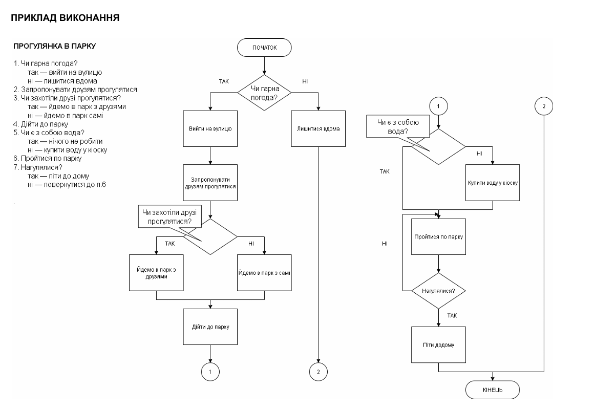

`Домашня робота №2`

## Складання алгоритмів з розгалуженням

Скласти словесний алгоритм та блок-схему за варіантами, наданими нижче.

Можна виконувати у [draw.io](https://draw.io/) або у будь-якому іншому зручному додатку.

Детальніше про блок-схеми можна прочитати тут: 
https://www.maxzosim.com/blok-skhema/

| № | Хто виконує | Суть завдання | Вхідні дані | Варіанти результатів та їх умови |
|---|---|---|---|---|
| 1 | Безсалько Костянтин | Порівняти два числа та вивести результат порівняння | Числа a, b | «a більше за b», якщо a > b; «a менше за b», якщо a < b; «Числа рівні», якщо a = b |
| 2 | В'юниченко Артем | Визначити знак введеного числа | Число x | «Додатне», якщо x > 0; «Від'ємне», якщо x < 0; «Нуль», якщо x = 0 |
| 3 | Варфоломєй Анна | Визначити агрегатний стан води за її температурою | Температура t (°C) | «Лід», якщо t ≤ 0; «Рідина», якщо 0 < t < 100; «Пара», якщо t ≥ 100 |
| 4 | Волков Артем | За номером дня тижня визначити, робочий це день чи вихідний | Номер дня n | «Робочий день», якщо 1 ≤ n ≤ 5; «Вихідний», якщо n = 6 або n = 7; «Помилка введення», якщо n < 1 або n > 7 |
| 5 | Галушкіна Софія | За номером місяця визначити пору року | Номер місяця m | «Зима», якщо m = 12, 1 або 2; «Весна», якщо 3 ≤ m ≤ 5; «Літо», якщо 6 ≤ m ≤ 8; «Осінь», якщо 9 ≤ m ≤ 11; «Помилка введення» в інших випадках |
| 6 | Гаража Макар | Перевести бал за 100-бальною шкалою в словесну оцінку | Бал b | «Відмінно», якщо 90 ≤ b ≤ 100; «Добре», якщо 75 ≤ b ≤ 89; «Задовільно», якщо 60 ≤ b ≤ 74; «Незадовільно», якщо 0 ≤ b ≤ 59; «Некоректний бал», якщо b < 0 або b > 100 |
| 7 | Іванов Ілля | Визначити вікову категорію людини | Вік v (років) | «Некоректний вік», якщо v < 0; «Дитина», якщо v < 12; «Підліток», якщо 12 ≤ v ≤ 17; «Дорослий», якщо 18 ≤ v ≤ 59; «Пенсіонер», якщо v ≥ 60 |
| 8 | Капустін Максим | За рівнем заряду батареї вивести повідомлення для користувача | Заряд z (%) | «Заряд повний», якщо 80 ≤ z ≤ 100; «Заряд у нормі», якщо 20 ≤ z ≤ 79; «Низький заряд, підключіть зарядку», якщо 1 ≤ z ≤ 19; «Пристрій вимкнено», якщо z = 0; «Помилка даних», якщо z < 0 або z > 100 |
| 9 | Коваленко Артем | Визначити кількість цифр у натуральному числі | Число n | «Число має бути натуральним», якщо n ≤ 0; «Однозначне», якщо n ≤ 9; «Двозначне», якщо 10 ≤ n ≤ 99; «Тризначне», якщо 100 ≤ n ≤ 999; «Більше трьох цифр», якщо n ≥ 1000 |
| 10 | Мікула Софія | Знайти найменше з трьох чисел | Числа a, b, c | a, якщо a ≤ b і a ≤ c; b, якщо b ≤ a і b ≤ c; c в інших випадках |
| 11 | Москалець Руслан | Перевірити логін і пароль користувача при вході в систему | Логін, пароль (та еталонні значення) | «Користувача не знайдено», якщо логін не збігається; «Невірний пароль», якщо логін збігається, а пароль ні; «Вхід виконано», якщо збігаються обидва |
| 12 | Панасенко Кирило | Виконати арифметичну дію над двома числами за введеним знаком операції | Числа a, b, знак op | a + b, a − b або a · b для відповідних знаків; a / b, якщо op = «/» і b ≠ 0; «Ділення на нуль неможливе», якщо op = «/» і b = 0; «Невідома операція» для будь-якого іншого знаку |
| 13 | Пристинський Юрій | Розрахувати вартість доставки посилки за її вагою | Вага m (кг) | «Помилка введення», якщо m ≤ 0; 50 грн, якщо 0 < m ≤ 1; 80 грн, якщо 1 < m ≤ 5; 80 грн + 10 грн за кожен кг понад 5, якщо m > 5 |
| 14 | Хорсун Тимур | Розв'язати лінійне рівняння ax + b = 0 | Коефіцієнти a, b | x = −b / a, якщо a ≠ 0; «Безліч коренів», якщо a = 0 і b = 0; «Коренів немає», якщо a = 0 і b ≠ 0 |
| 15 | Черниш Софія | Визначити розташування точки на координатній площині | Координати x, y | «I чверть», якщо x > 0 і y > 0; «II чверть», якщо x < 0 і y > 0; «III чверть», якщо x < 0 і y < 0; «IV чверть», якщо x > 0 і y < 0; «Початок координат», якщо x = 0 і y = 0; «Точка на осі» в інших випадках |
<!--| 16 |  | Визначити положення точки відносно кола з центром у початку координат | Координати x, y; радіус R | «Некоректний радіус», якщо R ≤ 0; «Всередині кола», якщо x² + y² < R²; «На колі», якщо x² + y² = R²; «Поза колом», якщо x² + y² > R² |
| 17 |  | Розв'язати квадратне рівняння ax² + bx + c = 0 | Коефіцієнти a, b, c | «Рівняння не є квадратним», якщо a = 0; два корені x₁,₂ = (−b ± √D) / 2a, якщо D > 0; один корінь x = −b / 2a, якщо D = 0; «Дійсних коренів немає», якщо D < 0 (де D = b² − 4ac) |
| 18 |  | Визначити вид трикутника за його кутами | Кути α, β, γ (у градусах) | «Трикутник не існує», якщо будь-який кут ≤ 0 або α + β + γ ≠ 180; «Прямокутний», якщо один із кутів = 90; «Тупокутний», якщо один із кутів > 90; «Гострокутний» в інших випадках |
| 19 |  | Визначити вид трикутника за довжинами сторін | Сторони a, b, c | «Трикутник не існує», якщо хоча б одна сторона ≥ суми двох інших; «Рівносторонній», якщо a = b = c; «Рівнобедрений», якщо рівні лише дві сторони; «Різносторонній», якщо всі сторони різні |
| 20 |  | Розрахувати ціну квитка в кіно залежно від віку глядача та дня тижня (базова ціна 150 грн) | Вік v, номер дня n | «Безкоштовно», якщо v < 6; 75 грн (знижка 50 %), якщо 6 ≤ v ≤ 17 у будні; 150 грн, якщо v ≥ 18 у будні; ціна зростає на 20 % (90 або 180 грн), якщо n = 6 або 7 і v ≥ 6 |-->

---

    У MyStat потрібно завантажити блок-схему та словесний опис алгоритму

---