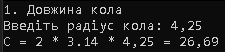

`Домашня робота №3`

## Складання програми розрахунку простих формул

Написати програму на мові C#, яка за введеними вхідними даними робить розрахунок формули та виводить результат на екран. Вхідні дані мають вводитися користувачем.

При виведенні результату має виводитись **назва формули** та **проміжний розрахунок**. 

### Приклад програми 

Нижче надано код програми для розрахунку довжини кола:

```c#
using System.Text;

// Для коректної роботи української мови
Console.OutputEncoding = UTF8Encoding.UTF8;
Console.OutputEncoding = UTF8Encoding.UTF8;


// ДОВЖИНА КОЛА
// 2 * pi (3.14) * r

Console.WriteLine("1. Довжина кола");

// Введення вхідних даних
Console.Write("Введіть радіус кола: ");
double r = Convert.ToDouble( Console.ReadLine() );

// Розрахунок результату
double C = 2 * 3.14 * r;

// Виведення результату
Console.WriteLine($"C = 2 * 3.14 * {r} = {C}");
```
У консолі це виглядатиме наступним чином:



### Варіанти завдань

| № | Назва формули | Вхідні дані | Формула |
|---|---|---|---|
| 1 | Периметр прямокутника | Сторони a, b | P = 2 * (a + b) |
| 2 | Об'єм прямокутного паралелепіпеда | Ребра a, b, c | V = a * b * c |
| 3 | Площа поверхні паралелепіпеда | Ребра a, b, c | S = 2 * (a * b + b * c + a * c) |
| 4 | Площа трикутника за основою та висотою | Основа a, висота h | S = a * h / 2 |
| 5 | Площа трапеції | Основи a, b, висота h | S = (a + b) * h / 2 |
| 6 | Середнє арифметичне трьох чисел | Числа a, b, c | M = (a + b + c) / 3 |
| 7 | Шлях при рівномірному русі | Швидкість v, час t | S = v * t |
| 8 | Переведення градусів Цельсія у Фаренгейти | Температура c | f = c * 9 / 5 + 32 |
| 9 | Ціна товару з ПДВ | Ціна без ПДВ p, ставка v (%) | price = p + p * v / 100 |
| 10 | Сила струму за законом Ома | Напруга u, опір r | i = u / r |
| 11 | Потужність електричного кола | Напруга u, сила струму i | p = u * i |
| 12 | Плата за електроенергію | Спожито кВт·год k, тариф t (коп.) | cost = k * t / 100 |
| 13 | Кінетична енергія тіла | Маса m, швидкість v | e = m * v * v / 2 |
| 14 | Розмір зображення у байтах | Ширина w, висота h, глибина кольору i (біт) | size = w * h * i / 8 |
| 15 | Конвертація валюти | Сума в доларах d, курс k (коп. за 1 $) | uah = d * k / 100 |

### Розподілення варіантів

| № | Хто виконує | Варіант 1 | Варіант 2 | Варіант 3 |
|---|---|---|---|---|
|	1	|	Безсалько Костянтин	|	4	|	8	|	12	|
|	2	|	В'юниченко Артем	|	1	|	10	|	14	|
|	3	|	Варфоломєй Анна	|	4	|	7	|	14	|
|	4	|	Волков Артем	|	3	|	8	|	13	|
|	5	|	Галушкіна Софія	|	1	|	7	|	12	|
|	6	|	Гаража Макар	|	3	|	9	|	11	|
|	7	|	Іванов Ілля	|	3	|	9	|	15	|
|	8	|	Капустін Максим	|	2	|	10	|	14	|
|	9	|	Коваленко Артем	|	2	|	10	|	11	|
|	10	|	Мікула Софія	|	1	|	6	|	15	|
|	11	|	Москалець Руслан	|	5	|	6	|	13	|
|	12	|	Панасенко Кирило	|	4	|	9	|	13	|
|	13	|	Пристинський Юрій	|	5	|	8	|	11	|
|	14	|	Хорсун Тимур	|	5	|	6	|	15	|
|	15	|	Черниш Софія	|	2	|	7	|	12	|

> Виконати необхідно **ВСІ варіанти**, які вказані навпроти прізвища. Тобто в кожній програмі **має бути реалізовано ТРИ формули**!

---

<p style="text-align: center">
    У MyStat потрібно завантажити блок-схему та словесний опис алгоритму
</p>

---