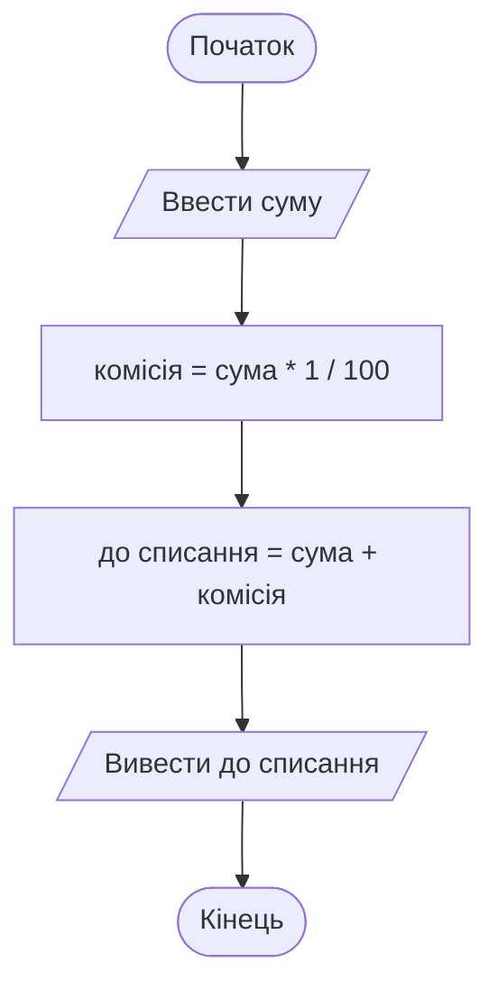

# 1. Вступ до алгоритмів

![block-badge]

## Зміст
1. [Що таке алгоритм](#що-таке-алгоритм)
2. [Виконавець алгоритму](#виконавець-алгоритму)
3. [Властивості алгоритму](#властивості-алгоритму)
4. [Види алгоритмів](#види-алгоритмів)
5. [Способи представлення алгоритмів](#способи-представлення-алгоритмів)
6. [Порівняння способів представлення](#порівняння-способів-представлення)
7. [Алгоритми навколо нас](#алгоритми-навколо-нас)
8. [Підсумок](#підсумок)
9. [Запитання для самоперевірки](#запитання-для-самоперевірки)
10. [Довідкові матеріали](#довідкові-матеріали)

---

## Що таке алгоритм

Уявіть, що вам потрібно пояснити бабусі, як зняти гроші в банкоматі. Фраза «Та просто зніми гроші» не допоможе: що натискати? У якому порядку? Що робити, якщо банкомат пише «Неправильний PIN»? Щоб людина (чи машина) впоралася із завданням, їй потрібна **чітка послідовність кроків**.

> **Алгоритм** (algorithm) — це скінченна послідовність чітких інструкцій, виконання яких приводить до розв'язання задачі. _Алгоритм описує не лише що треба отримати, а й як саме це зробити: крок за кроком_.

Для бабусі алгоритм зняття готівки може виглядати так:

1. Вставити картку в банкомат.
2. Ввести PIN-код.
3. Обрати пункт «Зняти готівку».
4. Ввести суму.
5. Забрати картку.
6. Забрати гроші.

Саме з таких кроків складається будь-яка програма. Комп'ютер не здогадується, чого ви хочете, і не «додумує» пропущене: він виконує **рівно ті команди**, які йому дали, і в тому порядку, в якому їх записано. Тому вміння скласти правильний алгоритм — перше й найважливіше вміння програміста. Мова програмування — лише спосіб записати вже готовий алгоритм так, щоб його зрозумів комп'ютер.

> [!NOTE]
> **Зверніть увагу:** слово «алгоритм» походить від імені перського вченого IX століття **аль-Хорезмі** (al-Khwarizmi). Його праці з арифметики переклали латиною, і ім'я автора в латинському написанні _Algoritmi_ поступово стало назвою будь-якої чіткої послідовності дій.

**Де трапляються алгоритми в житті:**

- рецепт приготування страви
- інструкція зі збирання шафи
- правила переходу дороги на світлофорі
- маршрут, який будує навігатор
- будь-яка комп'ютерна програма

---

## Виконавець алгоритму

Алгоритм завжди пишеться **для когось**. Те, що зрозуміло дорослому, може бути незрозумілим першокласнику, а те, що зрозуміло людині, — зовсім незрозумілим банкомату.

> **Виконавець алгоритму** (performer) — той (або те), хто виконує команди алгоритму: людина, тварина, робот, комп'ютер. _Виконавець уміє виконувати лише певний набір команд — і більше нічого_.

> **Система команд виконавця** (СКВ) — це повний перелік команд, які виконавець здатен виконати. _Алгоритм для виконавця можна складати лише з команд його СКВ_.

| Виконавець | Приклади команд, які він уміє виконати | Чого він НЕ вміє |
| :---- | :---- | :---- |
| **Людина-кухар** | нарізати, посолити, варити 10 хвилин, спробувати на смак | виконати рецепт іноземною мовою, якої не знає |
| **Банкомат** | прочитати картку, перевірити PIN, видати купюри, надрукувати чек | видати 125 грн, якщо в нього лише купюри по 100 і 200 |
| **Робот-пилосос** | їхати вперед, повернути, увімкнути щітку, повернутися на базу | помити посуд |
| **Комп'ютер** | обчислити вираз, запам'ятати значення, вивести текст на екран, прочитати введене з клавіатури | зрозуміти команду «зроби, як я хочу» |

Людина — **неформальний** виконавець: вона може здогадатися, що мав на увазі автор, і виправити очевидну помилку в інструкції. Комп'ютер — **формальний** виконавець: він виконує кожну команду буквально, не замислюючись про її зміст.

> [!IMPORTANT]
> **Ключова ідея:** комп'ютер не вгадує ваших намірів. Якщо алгоритм містить помилку, комп'ютер слухняно виконає і її. Тому алгоритм для комп'ютера має бути особливо точним.

---

## Властивості алгоритму

Не кожна інструкція є алгоритмом. Фраза «Розберися з банкоматом якось» — не алгоритм, хоча й описує, що треба зробити. Щоб послідовність дій вважалася алгоритмом, вона має відповідати кільком вимогам — **властивостям алгоритму**.

| Властивість | Що означає | Що НЕ так, якщо її порушити |
| :---- | :---- | :---- |
| **Дискретність** (discreteness) | алгоритм розбитий на окремі завершені кроки, які виконуються один за одним | «Зніми гроші» — один величезний крок, незрозуміло, з чого почати |
| **Зрозумілість** (understandability) | кожна команда входить до системи команд виконавця | «Прикладіть палець до сканера» — у банкомата немає сканера |
| **Визначеність** (definiteness) | кожна команда трактується однозначно, без варіантів «на розсуд» | «Введіть кілька цифр» — скільки саме? «Зніміть трохи грошей» — це скільки? |
| **Результативність** | виконання алгоритму завжди приводить до результату | банкомат «завис» і не видав ні грошей, ні повідомлення про помилку |
| **Скінченність** (finiteness) | алгоритм завершується за скінченну кількість кроків | «Вводьте PIN, доки не вгадаєте» — можна вводити вічно |
| **Масовість** (generality) | алгоритм придатний для цілого класу однотипних задач, а не лише для одного випадку | алгоритм уміє знімати лише 500 грн і лише з картки Олени |

Подивіться, як реальний банкомат забезпечує ці властивості. **Скінченність**: після трьох неправильних спроб введення PIN картку блокують, тож нескінченно вгадувати не вийде. **Результативність**: навіть якщо грошей на рахунку недостатньо, ви отримаєте результат — повідомлення «Недостатньо коштів», а не тишу. **Масовість**: той самий алгоритм працює для будь-якої картки й будь-якої суми.

> [!WARNING]
> **Часта плутанина:** визначеність — це не «багато слів», а **однозначність**. Відомий жарт: дружина просить чоловіка-програміста: «Купи батон. Якщо будуть яйця — візьми десяток». Він повертається з десятьма батонами: яйця ж були! Інструкція допускала два тлумачення — тобто не мала властивості визначеності.

> [!IMPORTANT]
> **Ключова ідея:** алгоритм — це послідовність **окремих** (дискретність), **зрозумілих виконавцю** (зрозумілість) та **однозначних** (визначеність) кроків, яка **завжди завершується** (скінченність) з **результатом** (результативність) і підходить для **будь-яких** даних свого типу (масовість).

---

## Види алгоритмів

За тим, у якому порядку виконуються кроки, алгоритми поділяють на три основні види.

> **Лінійний алгоритм** (linear algorithm) — алгоритм, у якому всі кроки виконуються _один за одним, по черзі, без пропусків і повторень_.

Приклад — «ідеальне» зняття готівки, коли все йде без проблем: вставити картку → ввести PIN → ввести суму → забрати картку → забрати гроші. Кожен крок виконується рівно один раз, у фіксованому порядку.

> **Алгоритм з розгалуженням** (розгалужений алгоритм, branching algorithm) — алгоритм, у якому _залежно від виконання певної умови_ виконується одна або інша послідовність кроків.

Приклад: після введення суми банкомат перевіряє умову «Чи вистачає коштів на рахунку?».

- **так** → видати гроші
- **ні** → показати повідомлення «Недостатньо коштів»

Умова — це питання, на яке можна відповісти лише «так» або «ні». Від відповіді залежить, яким шляхом піде виконання.

> **Циклічний алгоритм** (алгоритм з повторенням, loop) — алгоритм, у якому _певна група кроків виконується кілька разів_, доки виконується умова повторення.

Приклад: введення PIN-коду. Банкомат повторює крок «ввести PIN», поки PIN неправильний **і** використано менше трьох спроб. Інший приклад з життя — «поки чайник не закипів — чекати».

| Вид | Як виконуються кроки | Ключові слова у словесному описі | Приклад у банкоматі |
| :---- | :---- | :---- | :---- |
| **Лінійний** | по черзі, кожен рівно один раз | «спочатку», «потім», «далі» | вставити картку, ввести PIN, ввести суму |
| **З розгалуженням** | вибір одного з шляхів за умовою | «якщо... то... інакше...» | чи вистачає коштів на рахунку |
| **Циклічний** | група кроків повторюється | «повторювати, поки...», «N разів» | повторне введення PIN (до 3 спроб) |

> [!NOTE]
> **Зверніть увагу:** у реальних задачах ці види майже ніколи не трапляються «в чистому вигляді». Повний алгоритм банкомата містить і лінійні ділянки, і розгалуження, і цикли. Це як цеглинки, з яких складається будь-який алгоритм. Цикли детально розглянемо в окремій темі; у цьому й наступному уроці зосередимося на лінійних алгоритмах і розгалуженнях.

---

## Способи представлення алгоритмів

Один і той самий алгоритм можна записати по-різному. Розглянемо невелику частину роботи банкомата: **розрахунок комісії**. Банкомат «чужого» банку бере комісію 1% від суми. Треба обчислити, скільки грошей буде списано з картки.

### Словесний спосіб

> **Словесний спосіб** — опис алгоритму _звичайною мовою_ у вигляді пронумерованих кроків.

1. Отримати суму, яку хоче зняти клієнт.
2. Обчислити комісію: 1% від суми.
3. Обчислити суму до списання: сума + комісія.
4. Показати клієнту суму до списання.

Це найпростіший і найзрозуміліший людині спосіб. Але звичайна мова неточна: одну фразу різні люди можуть зрозуміти по-різному, а для великих алгоритмів словесний опис стає довгим і заплутаним.

### Графічний спосіб

> **Графічний спосіб** — зображення алгоритму у вигляді _схеми з геометричних фігур (блоків), з'єднаних стрілками_. Найпоширеніший різновид — **блок-схема** (flowchart).



На схемі: той самий алгоритм розрахунку комісії, де кожен крок — окремий блок, а стрілки показують порядок виконання.

Кожен вид дії має свою форму блоку: овал — початок і кінець, паралелограм — введення чи виведення даних, прямокутник — обчислення. Блок-схема наочна: з одного погляду видно, куди «йде» алгоритм і де він розгалужується. Правила побудови блок-схем детально розглянемо в наступному уроці.

### Псевдокод

> **Псевдокод** (pseudocode) — запис алгоритму _напівформальною мовою_, схожою на мову програмування, але без її суворих правил.

```text
початок
    ввести сума
    комісія := сума * 1 / 100
    до_списання := сума + комісія
    вивести до_списання
кінець
```

Знак `:=` у псевдокоді означає «записати значення» (у блок-схемах і в мовах програмування для цього зазвичай пишуть `=`). Псевдокод не має єдиного стандарту: кожен автор пише трохи по-своєму. Його використовують, щоб коротко й точно записати ідею алгоритму, не відволікаючись на деталі конкретної мови програмування.

### Програмний спосіб

> **Програмний спосіб** — запис алгоритму _мовою програмування_. Такий запис називають **програмою**, і його вже може виконати комп'ютер.

Той самий алгоритм мовою C#:

```C#
Console.Write("Введіть суму: ");
double amount = Convert.ToDouble(Console.ReadLine());
double commission = amount * 1 / 100;
double total = amount + commission;
Console.WriteLine($"До списання: {total} грн");
```

Поки що не треба розуміти кожен символ цього коду. Зверніть увагу лише на те, що кожному кроку словесного опису (і кожному блоку блок-схеми) відповідає один-два рядки програми: перший рядок лише виводить підказку «Введіть суму», а другий отримує саму суму. Як писати такі програми, розберемо в уроках про мову C#.

> [!IMPORTANT]
> **Ключова ідея:** спосіб запису змінюється, а **алгоритм залишається тим самим**. Програміст спочатку продумує алгоритм (у голові, словами чи блок-схемою), а вже потім записує його мовою програмування.

---

## Порівняння способів представлення

| Критерій | Словесний | Блок-схема | Псевдокод | Програмний |
| :---- | :---- | :---- | :---- | :---- |
| **Для кого** | для людини | для людини | для людини (програміста) | для комп'ютера (і програміста) |
| **Наочність** | низька для великих алгоритмів | висока: структуру видно одразу | середня | залежить від досвіду читача |
| **Точність** | низька: можливі різні тлумачення | висока | висока | максимальна: жодних тлумачень |
| **Чи виконає комп'ютер** | ні | ні | ні | так |
| **Коли використовують** | пояснити ідею, інструкції для людей | спланувати й пояснити логіку, документація | обговорити алгоритм, підручники, співбесіди | реальна робота програми |

**Головна різниця** — словесний опис, блок-схема та псевдокод потрібні **людям**, щоб продумати й пояснити алгоритм, а програма потрібна **комп'ютеру**, щоб цей алгоритм виконати.

> [!TIP]
> **Порада:** перш ніж писати код складної задачі, складіть для неї словесний алгоритм або блок-схему. Помилку в логіці значно легше помітити на схемі з десяти блоків, ніж у програмі зі ста рядків.

---

## Алгоритми навколо нас

Ви користуєтеся алгоритмами щодня, навіть не замислюючись про це:

| Де | Який алгоритм працює | Вид |
| :---- | :---- | :---- |
| **Світлофор** | зелений → жовтий → червоний → ... і знову по колу | циклічний |
| **Пральна машина** | програма прання: набрати воду → прати → полоскати (кілька разів) → віджати | лінійний з повторенням |
| **Навігатор ([Google Maps](https://www.google.com/maps))** | пошук найкоротшого маршруту; якщо попереду затор — перебудувати маршрут | з розгалуженнями й повтореннями |
| **Стрічка рекомендацій (YouTube, TikTok)** | аналіз того, що ви дивилися, і вибір наступного відео | складний, з тисячами умов |
| **Турнікет у метро** | прочитати картку → якщо на ній є кошти, відкрити прохід, інакше — ні | з розгалуженням |
| **Гра** | поки гравець живий: прочитати натиснуті клавіші → перемістити персонажа → намалювати кадр | циклічний |

Кожен із цих алгоритмів хтось колись склав, перевірив і записав мовою програмування. Саме цього ви й навчитеся на цьому курсі.

---

## Підсумок

- **алгоритм** — скінченна послідовність чітких інструкцій, що приводить до розв'язання задачі
- алгоритм складають для конкретного **виконавця** і лише з команд його **системи команд**; комп'ютер — формальний виконавець, він виконує команди буквально
- властивості алгоритму: **дискретність, зрозумілість, визначеність, результативність, скінченність, масовість**
- види алгоритмів: **лінійний, з розгалуженням, циклічний**
- способи представлення: **словесний, графічний** (блок-схема), **псевдокод** і **програмний**

---

## Запитання для самоперевірки

1. Що таке алгоритм? Наведіть два приклади алгоритмів із повсякденного життя.
2. Що таке виконавець алгоритму та система команд виконавця?
3. Чим формальний виконавець відрізняється від неформального? До якого типу належить комп'ютер?
4. Яку властивість алгоритму порушує інструкція «Посоліть за смаком»? А інструкція «Мішайте, доки не набридне»?
5. Чим лінійний алгоритм відрізняється від алгоритму з розгалуженням?
6. Наведіть приклад циклічного алгоритму. Яка умова визначає, коли повторення закінчиться?
7. Назвіть способи представлення алгоритмів. Який із них може виконати комп'ютер?
8. Чому програмісти часто складають блок-схему або псевдокод, перш ніж писати програму?

---

## Довідкові матеріали

- [Алгоритм](https://uk.wikipedia.org/wiki/%D0%90%D0%BB%D0%B3%D0%BE%D1%80%D0%B8%D1%82%D0%BC) — `uk.wikipedia.org`
- [Аль-Хорезмі](https://uk.wikipedia.org/wiki/%D0%90%D0%BB%D1%8C-%D0%A5%D0%BE%D1%80%D0%B5%D0%B7%D0%BC%D1%96) — `uk.wikipedia.org`
- [Блок-схема](https://uk.wikipedia.org/wiki/%D0%91%D0%BB%D0%BE%D0%BA-%D1%81%D1%85%D0%B5%D0%BC%D0%B0) — `uk.wikipedia.org`
- [Псевдокод](https://uk.wikipedia.org/wiki/%D0%9F%D1%81%D0%B5%D0%B2%D0%B4%D0%BE%D0%BA%D0%BE%D0%B4) — `uk.wikipedia.org`
- [Algorithm](https://en.wikipedia.org/wiki/Algorithm) — `en.wikipedia.org`

---
[block-badge]:https://img.shields.io/badge/%D0%90%D0%BB%D0%B3%D0%BE%D1%80%D0%B8%D1%82%D0%BC%D0%B8-purple?style=flat
