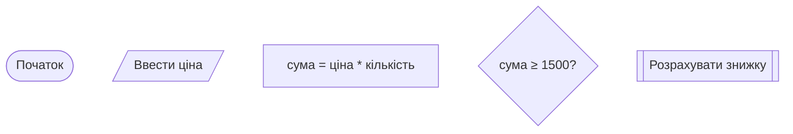
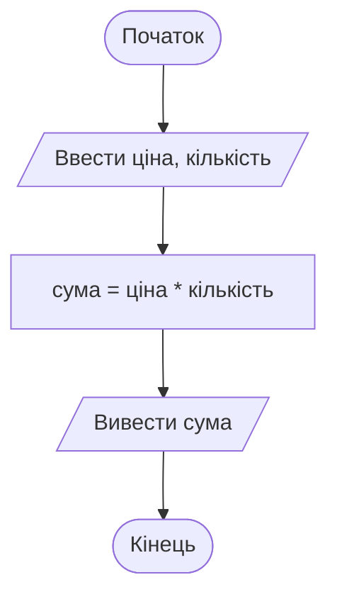
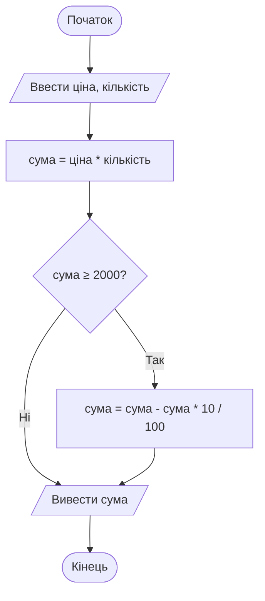
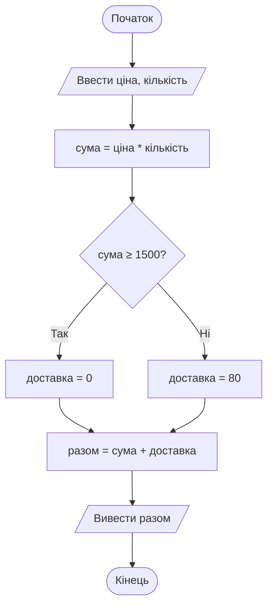
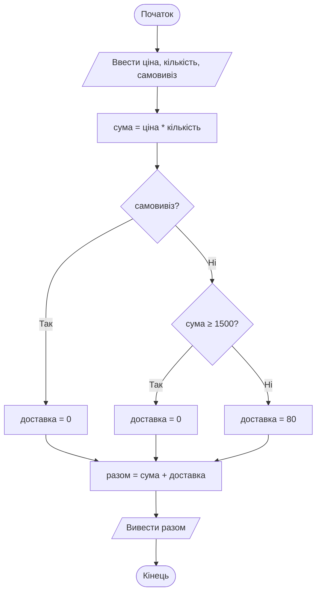
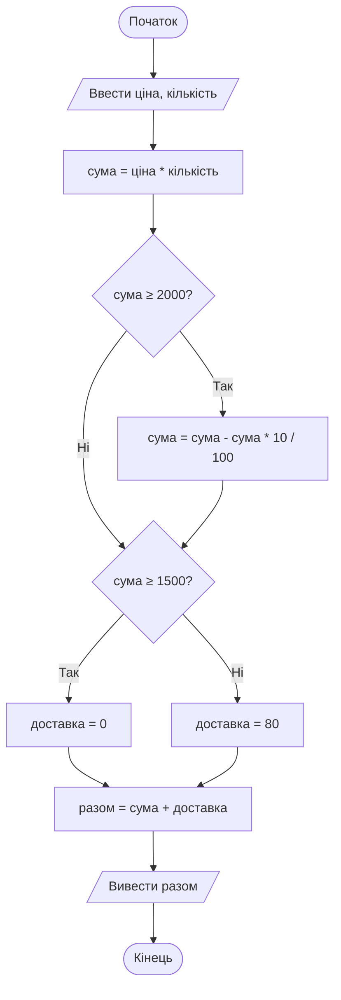
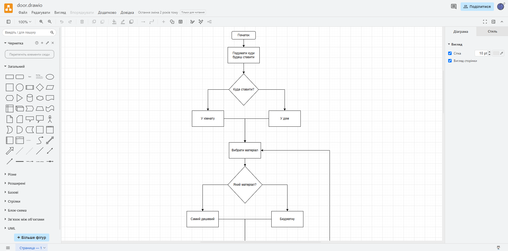

# 2. Блок-схеми

![block-badge]

## Зміст
1. [Що таке блок-схема](#що-таке-блок-схема)
2. [Основні блоки](#основні-блоки)
3. [Правила побудови блок-схем](#правила-побудови-блок-схем)
4. [Лінійний алгоритм](#лінійний-алгоритм)
5. [Розгалуження](#розгалуження)
6. [Перевірка алгоритму на тестових даних](#перевірка-алгоритму-на-тестових-даних)
7. [Типові помилки в блок-схемах](#типові-помилки-в-блок-схемах)
8. [Інструменти для побудови блок-схем](#інструменти-для-побудови-блок-схем)
9. [Де використовують блок-схеми](#де-використовують-блок-схеми)
10. [Підсумок](#підсумок)
11. [Запитання для самоперевірки](#запитання-для-самоперевірки)
12. [Довідкові матеріали](#довідкові-матеріали)

---

## Що таке блок-схема

Словесний алгоритм зручний, поки в ньому п'ять кроків. Але щойно з'являються умови («якщо... то... інакше...»), текст перетворюється на заплутаний клубок: «якщо так — перейдіть до кроку 7, інакше — до кроку 4, але якщо на кроці 4...». Розібратися в такому описі важко, а помилку в ньому легко пропустити.

> **Блок-схема** (flowchart) — графічне представлення алгоритму у вигляді _блоків стандартної форми, з'єднаних лініями зі стрілками_. Форма блоку показує тип дії, текст усередині — саму дію, а стрілки — порядок виконання.

Блок-схема дає змогу **побачити** алгоритм цілком: де він починається, де розгалужується і чим закінчується. Форми блоків визначені міжнародним стандартом **ISO 5807**, тому блок-схему, намальовану в одній країні, зрозуміють програмісти в іншій.

У цьому уроці всі приклади будуть про одну задачу — **розрахунок вартості замовлення в інтернет-магазині**. Почнемо з найпростішої версії й поступово ускладнюватимемо її.

---

## Основні блоки

На схемі: п'ять основних блоків — термінатор, введення/виведення, дія, умова та підпрограма — з прикладами тексту в них.

| Блок | Форма | Призначення | Приклад тексту |
| :---- | :---- | :---- | :---- |
| **Термінатор** | овал (прямокутник із заокругленими кінцями) | початок і кінець алгоритму | `Початок`, `Кінець` |
| **Введення / виведення** | паралелограм | отримання даних від користувача або показ результату | `Ввести ціна`, `Вивести сума` |
| **Дія (процес)** | прямокутник | обчислення, присвоювання значення | `сума = ціна * кількість` |
| **Умова (рішення)** | ромб | перевірка умови; має **два** виходи: «Так» і «Ні» | `сума ≥ 1500?` |
| **Підпрограма** (визначений процес, predefined process) | прямокутник із подвійними бічними стінками | дія, яка детально описана в іншому місці (окремою схемою) | `Розрахувати знижку` |
| **Лінія потоку** | лінія зі стрілкою | показує, який блок виконується наступним | — |

> [!NOTE]
> **Зверніть увагу:** у ромбі записується **питання**, на яке можна відповісти лише «так» або «ні»: `сума ≥ 1500?`, `є картка клієнта?`. Запис `сума` або `перевірити суму` — не умова: незрозуміло, що саме перевіряється.

Записи на кшталт `сума = ціна * кількість` у блоці дії читаються так: «обчислити `ціна * кількість` і записати результат у `сума`». Тут `ціна`, `кількість`, `сума` — **змінні**: іменовані «комірки», у яких алгоритм зберігає дані. Імена змінних у блоках завжди пишуть в одній формі, тому `Ввести ціна`, а не «Ввести ціну»: так одразу видно, що йдеться про змінну `ціна`. Знак `*` означає множення (так його записують у мовах програмування).

---

## Правила побудови блок-схем

**Основні правила:**

- у схемі **один** блок `Початок` і, як правило, **один** блок `Кінець`
- схема читається **згори донизу** і **зліва направо**; стрілки ставимо на всіх лініях, а на лініях, що йдуть у зворотному напрямку (вгору чи вліво), вони обов'язкові за стандартом
- у кожен блок (крім `Початок`) входить хоча б одна лінія, з кожного блоку (крім `Кінець`) виходить **рівно одна** лінія — окрім ромба
- з ромба виходять **дві** лінії, і кожна підписана: `Так` / `Ні`
- **один блок — одна дія**: не варто писати «ввести ціну, обчислити суму й вивести її» в одному прямокутнику
- кожен шлях від `Початок` має рано чи пізно дійти до `Кінець` — ліній, що «обриваються в нікуди», не буває
- текст у блоках короткий і точний; змінну не можна використовувати, доки їй не присвоєно значення (не введено чи не обчислено)
- лінії бажано не перетинати; якщо схема не вміщується, її розбивають на частини (підпрограми)

> [!TIP]
> **Порада:** перш ніж малювати, складіть короткий словесний алгоритм. Кожен його крок зазвичай стає окремим блоком, а кожне «якщо» — ромбом.

---

## Лінійний алгоритм

**Задача:** користувач вводить ціну товару та кількість. Потрібно обчислити й вивести суму замовлення.

Словесний алгоритм:

1. Ввести ціну товару.
2. Ввести кількість.
3. Обчислити суму: ціна × кількість.
4. Вивести суму.

На схемі: лінійний алгоритм розрахунку суми замовлення — блоки виконуються строго по черзі, кожен рівно один раз.

Зверніть увагу: введення двох значень записано в одному паралелограмі. Це допустимо, коли дані вводяться разом і однаково: `Ввести ціна, кількість`. А от обчислення суми — окрема дія, тому окремий прямокутник.

> [!IMPORTANT]
> **Ключова ідея:** блок-схема лінійного алгоритму — це «ланцюжок» блоків без жодного ромба: від `Початок` до `Кінець` веде лише **один** шлях.

---

## Розгалуження

> **Розгалуження** (branching) — конструкція алгоритму, у якій _залежно від умови виконується одна з кількох послідовностей дій_. На блок-схемі розгалуження завжди починається з ромба.

Розрізняють кілька видів розгалуження. Розглянемо їх, ускладнюючи нашу задачу.

### Неповне розгалуження

**Задача:** якщо сума замовлення становить 2000 грн або більше, магазин дає знижку 10%. Інакше сума не змінюється.

На схемі: дія виконується лише за гілкою «Так»; гілка «Ні» оминає її і веде одразу до виведення.

> **Неповне розгалуження** — розгалуження, у якому _дія виконується лише при виконанні умови_, а якщо умова не виконується, алгоритм просто йде далі. Словесно: «**якщо** умова, **то** дія».

Зверніть увагу на блок `сума = сума - сума * 10 / 100`: нове значення змінної обчислюється з її старого значення. Якщо до цього блоку `сума` була 2400, то після нього стане `2400 - 240 = 2160`.

### Повне розгалуження

**Задача:** доставка безкоштовна, якщо сума замовлення від 1500 грн. Інакше доставка коштує 80 грн. Потрібно вивести загальну суму до сплати.

На схемі: кожна з гілок виконує свою дію, після чого гілки сходяться в одній точці й алгоритм продовжується спільним шляхом.

> **Повне розгалуження** — розгалуження, у якому _для кожного результату умови є своя дія_. Словесно: «**якщо** умова, **то** дія 1, **інакше** дія 2».

**Головна різниця** між повним і неповним розгалуженням — у неповному одна з гілок «порожня» (нічого не робить), а в повному обидві гілки виконують дії.

> [!WARNING]
> **Часта помилка:** забути з'єднати гілки після розгалуження. Після ромба гілки «Так» і «Ні» мають знову зійтися (або кожна має окремо дійти до `Кінець`). Гілка, яка «обривається», означає, що алгоритм у цьому випадку не знає, що робити далі, — порушено властивість результативності.

### Вкладене розгалуження

**Задача:** клієнт може обрати самовивіз — тоді доставка безкоштовна за будь-якої суми. Якщо самовивіз не обрано, діє правило з попереднього прикладу.

На схемі: друга умова (`сума ≥ 1500?`) перевіряється лише тоді, коли відповідь на першу (`самовивіз?`) — «Ні»; внутрішній ромб має власні дві гілки, і всі три шляхи сходяться перед обчисленням `разом`.

> **Вкладене розгалуження** — розгалуження, _всередині гілки якого міститься ще одне розгалуження_. Використовується, коли для вибору дії недостатньо однієї умови.

| Вид розгалуження | Словесний шаблон | Скільки гілок виконують дії | Приклад |
| :---- | :---- | :---- | :---- |
| **Неповне** | якщо ..., то ... | одна | знижка 10% від 2000 грн |
| **Повне** | якщо ..., то ..., інакше ... | обидві | доставка 0 або 80 грн |
| **Вкладене** | якщо ..., то ..., інакше якщо ..., то ..., інакше ... | кожна з кількох | самовивіз або доставка за сумою |

> [!IMPORTANT]
> **Ключова ідея:** хоч скільки б умов було в алгоритмі, кожен ромб має рівно **два** виходи. Щоб обрати один із трьох і більше варіантів, ромби «ставлять один за одним» — так виникає вкладене розгалуження.

---

## Перевірка алгоритму на тестових даних

Блок-схему намальовано. Але як переконатися, що вона правильна? Потрібно **виконати її вручну** — «пройти пальцем» по схемі з конкретними числами.

> **Трасування** (tracing) — покрокове виконання алгоритму вручну на конкретних вхідних даних із записом значень змінних після кожного кроку. _Трасування дає змогу знайти помилку ще до того, як алгоритм перетворено на програму_.

Об'єднаємо знижку й доставку в одну схему:

На схемі: спочатку застосовується знижка (якщо вона є), а вже потім за отриманою сумою обчислюється доставка.

### Таблиця трасування

Виконаємо схему для замовлення: ціна 450 грн, кількість 2. Записуємо значення змінних після кожного блоку (прочерк — змінна ще не має значення):

| Крок | Блок | ціна | кількість | сума | доставка | разом |
| :---- | :---- | :---- | :---- | :---- | :---- | :---- |
| **1** | `Ввести ціна, кількість` | 450 | 2 | — | — | — |
| **2** | `сума = ціна * кількість` | 450 | 2 | 900 | — | — |
| **3** | `сума ≥ 2000?` → Ні | 450 | 2 | 900 | — | — |
| **4** | `сума ≥ 1500?` → Ні | 450 | 2 | 900 | — | — |
| **5** | `доставка = 80` | 450 | 2 | 900 | 80 | — |
| **6** | `разом = сума + доставка` | 450 | 2 | 900 | 80 | 980 |
| **7** | `Вивести разом` | 450 | 2 | 900 | 80 | **980** |

Результат 980 грн — саме стільки й має коштувати замовлення на 900 грн із платною доставкою.

### Як обирати тестові дані

Одного тесту недостатньо: він перевірив лише гілки «Ні». Тестові дані підбирають так, щоб:

- кожна гілка кожного ромба виконалася хоча б один раз
- перевірити **граничні значення** — числа, що стоять точно на межі умови (тут: 1500 і 2000)

| Тест | Вхідні дані | Що перевіряє | Очікуваний результат |
| :---- | :---- | :---- | :---- |
| **1** | ціна 450, кількість 2 | без знижки, платна доставка | 980 |
| **2** | ціна 750, кількість 2 | рівно 1500: межа безкоштовної доставки | 1500 |
| **3** | ціна 1000, кількість 2 | рівно 2000: межа знижки | 1800 |
| **4** | ціна 1200, кількість 3 | знижка й безкоштовна доставка | 3240 |

> [!WARNING]
> **Часта помилка:** переплутати `>` і `≥`. Якщо в ромбі написати `сума > 2000?`, то замовлення рівно на 2000 грн залишиться без знижки, хоча умова магазину — «від 2000 грн». Звичайний тест (наприклад, 2400 грн) цієї помилки не помітить — її виявить лише тест з граничним значенням 2000.

> [!IMPORTANT]
> **Ключова ідея:** блок-схема правильна лише тоді, коли для кожного набору тестових даних трасування дає очікуваний результат. Тестові дані підбирають так, щоб пройти **всі гілки** і **всі межі** умов.

---

## Типові помилки в блок-схемах

| Помилка | Чому це погано | Як правильно |
| :---- | :---- | :---- |
| **Гілки ромба без підписів** | незрозуміло, яка гілка «Так», а яка «Ні» | підписувати кожну лінію з ромба |
| **У ромба один вихід** або три виходи | ромб відповідає лише на питання «так/ні» | рівно два виходи; для трьох варіантів — два ромби |
| **Введення чи виведення в прямокутнику** | порушено стандарт: форма блоку має показувати тип дії | для введення/виведення — паралелограм |
| **Кілька дій в одному блоці** | схема втрачає наочність, важко трасувати | один блок — одна дія |
| **Лінія «в нікуди»** | алгоритм не знає, що робити далі | кожен шлях доводити до `Кінець` |
| **Умова без питання** (`сума`, `перевірка`) | незрозуміло, що саме перевіряється | конкретне питання: `сума ≥ 1500?` |
| **Змінна до введення чи обчислення** | у змінній ще немає значення | спочатку ввести або обчислити, потім використовувати |

---

## Інструменти для побудови блок-схем

Блок-схему можна намалювати й на папері, але в електронному вигляді її легше виправляти та здавати.

**[draw.io](https://www.drawio.com/)** (diagrams.net) — безкоштовний онлайн-редактор діаграм, який працює прямо в браузері без реєстрації.

1. Відкрийте [app.diagrams.net](https://app.diagrams.net/) → оберіть, де зберігати файл (**Device** — на комп'ютері) → **Create New Diagram** → **Blank Diagram** → **Create**.
2. На панелі фігур ліворуч знайдіть розділ **Flowchart** (якщо його немає — **+ More Shapes** → поставте галочку **Flowchart** → **Apply**).
3. Перетягуйте блоки на полотно; двічі клацніть по блоку, щоб ввести текст.
4. Наведіть курсор на блок і потягніть за синю стрілку до наступного блоку — з'явиться лінія потоку. Двічі клацніть по лінії, щоб підписати її (`Так` / `Ні`).
5. Збережіть схему як картинку: **File → Export as → PNG...**

**Інші інструменти:**

| Інструмент | Особливість |
| :---- | :---- |
| **[Lucidchart](https://www.lucidchart.com/)** | онлайн-редактор, зручний для спільної роботи; безкоштовна версія з обмеженнями |
| **Microsoft Visio** | професійний редактор діаграм від Microsoft, платний |
| **[Mermaid](https://mermaid.js.org/)** | схема описується **текстом**, а малюється автоматично; саме так створені блок-схеми в цьому уроці |

---

## Де використовують блок-схеми

Блок-схеми — це не лише навчальна вправа. Їх використовують усюди, де потрібно наочно описати послідовність дій з умовами:

| Де | Для чого |
| :---- | :---- |
| **Розробка програм** | спланувати логіку перед написанням коду, пояснити алгоритм колегам, описати роботу програми в документації |
| **Бізнес-процеси** | схема «як оформлюється замовлення» або «як обробляється повернення товару» в компанії |
| **Служба підтримки** | сценарій розмови оператора: «якщо клієнт каже X — запитайте Y» |
| **Медицина й безпека** | протоколи дій: схема надання першої допомоги, евакуації, дій у надзвичайній ситуації |
| **Інструкції до техніки** | розділ «Усунення несправностей»: «Не вмикається? → Чи підключено живлення? → ...» |

---

## Підсумок

- **блок-схема** — графічне представлення алгоритму з блоків стандартної форми, з'єднаних стрілками
- основні блоки: **овал** (початок/кінець), **паралелограм** (введення/виведення), **прямокутник** (дія), **ромб** (умова з двома виходами «Так»/«Ні»)
- розгалуження буває **неповним** (якщо — то), **повним** (якщо — то — інакше) і **вкладеним** (умова всередині гілки іншої умови)
- правильність схеми перевіряють **трасуванням** на тестових даних, що проходять усі гілки й **граничні значення**

---

## Запитання для самоперевірки

1. Що таке блок-схема? Чим вона зручніша за словесний опис алгоритму?
2. Яку форму мають блоки початку/кінця, введення/виведення, дії та умови?
3. Скільки виходів має блок умови? Як їх підписують?
4. Чим повне розгалуження відрізняється від неповного? Наведіть приклад кожного з життя.
5. Коли потрібне вкладене розгалуження?
6. Що таке трасування алгоритму? Як записують його результати?
7. Що таке граничні значення і чому їх обов'язково перевіряють?
8. Знайдіть помилку: у ромбі написано `вік`, а з нього виходять три лінії з підписами «дитина», «дорослий», «пенсіонер». Як виправити цю схему?

---

## Довідкові матеріали

- [Блок-схема](https://uk.wikipedia.org/wiki/%D0%91%D0%BB%D0%BE%D0%BA-%D1%81%D1%85%D0%B5%D0%BC%D0%B0) — `uk.wikipedia.org`
- [Блок-схема (Flowchart)](https://www.maxzosim.com/blok-skhema/) — `maxzosim.com`
- [Flowchart](https://en.wikipedia.org/wiki/Flowchart) — `en.wikipedia.org`
- [Flowchart Maker & Online Diagram Software](https://app.diagrams.net/) — `app.diagrams.net`

---
[block-badge]:https://img.shields.io/badge/%D0%90%D0%BB%D0%B3%D0%BE%D1%80%D0%B8%D1%82%D0%BC%D0%B8-purple?style=flat
