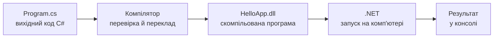

# 3. Середовище розробки Visual Studio та платформа .NET

![block-badge] ![lang-badge]

## Зміст
1. [Мова програмування та компіляція](#мова-програмування-та-компіляція)
2. [C# і платформа .NET](#c-і-платформа-net)
3. [Середовище розробки Visual Studio](#середовище-розробки-visual-studio)
4. [Створення консольного проєкту](#створення-консольного-проєкту)
5. [Перша програма](#перша-програма)
6. [Інструкції верхнього рівня](#інструкції-верхнього-рівня)
7. [Онлайн-компілятори](#онлайн-компілятори)
8. [Помилки компіляції](#помилки-компіляції)
9. [Коментарі](#коментарі)
10. [Корисні гарячі клавіші](#корисні-гарячі-клавіші)
11. [Де використовується C#](#де-використовується-c)
12. [Підсумок](#підсумок)
13. [Запитання для самоперевірки](#запитання-для-самоперевірки)
14. [Довідкові матеріали](#довідкові-матеріали)

---

## Мова програмування та компіляція

У попередніх уроках ми записували алгоритми словами й блок-схемами. Але комп'ютер не розуміє ні української мови, ні блок-схем. Процесор уміє виконувати лише дуже прості команди, записані у вигляді чисел, — **машинний код**. Писати програми одразу машинним кодом надзвичайно важко, тому придумали мови програмування.

> **Мова програмування** (programming language) — штучна мова зі строгими правилами, якою записують алгоритми для комп'ютера. _Вона достатньо зрозуміла людині й водночас достатньо точна, щоб її можна було автоматично перетворити на машинний код_.

Текст програми, написаний мовою програмування, називають **вихідним кодом** (source code). Щоб комп'ютер міг його виконати, код треба «перекласти».

> **Компілятор** (compiler) — програма, яка _перевіряє вихідний код на помилки й перетворює його на виконуваний файл_. Сам процес називають **компіляцією**.



На схемі: шлях від тексту програми до результату — компілятор перекладає код, а платформа .NET запускає скомпільовану програму. Точніше, компілятор C# створює не машинний код, а **проміжний** (IL, Intermediate Language); у машинний код його перетворює .NET вже під час запуску.

Якщо в коді є хоча б одна помилка (наприклад, пропущено символ), компілятор **відмовиться** його перекладати й покаже список помилок. Програма не запуститься, доки всі помилки не виправлено.

> [!NOTE]
> **Зверніть увагу:** є мови, програми якими не компілюються заздалегідь, а виконуються рядок за рядком спеціальною програмою — **інтерпретатором** (наприклад, Python або JavaScript). C# — компільована мова: перш ніж запустити програму, її обов'язково компілюють.

---

## C# і платформа .NET

> **C#** (читається «сі шарп», C Sharp) — сучасна мова програмування, представлена компанією Microsoft у 2000 році. _Це одна з найпопулярніших мов у світі: нею пишуть ігри, вебсайти, мобільні й настільні застосунки_.

Назва походить від музичної нотації: знак `♯` (дієз) означає підвищення ноти на півтону, тобто C# — «трохи вища» за мову C. Оскільки символу `♯` немає на клавіатурі, пишуть звичайну решітку `#`.

C# не працює сама по собі: програми цією мовою виконуються на платформі .NET.

> **.NET** (читається «дот нет») — безкоштовна платформа від Microsoft для створення й запуску програм. _Вона містить усе, що потрібно програмі для роботи: середовище виконання й величезну бібліотеку готового коду_.

| Складова | Що це | Аналогія |
| :---- | :---- | :---- |
| **Мова C#** | правила, за якими пишеться код | граматика мови |
| **Компілятор** | перевіряє код і перетворює його на програму | перекладач |
| **Середовище виконання** (runtime) | запускає скомпільовану програму й стежить за її роботою | сцена, на якій грають актори |
| **Бібліотека класів** | тисячі готових інструментів: робота з консоллю, файлами, мережею, математикою | набір інструментів, які не треба виготовляти самому |

Наприклад, команда `Console.WriteLine`, якою ми виводимо текст на екран, — це готовий інструмент із бібліотеки .NET. Нам не потрібно знати, як саме текст потрапляє в консоль: розробники .NET уже це реалізували.

> [!NOTE]
> **Зверніть увагу:** .NET працює на Windows, macOS і Linux, тож програми на C# можна запускати в усіх цих системах. Раніше існувала версія лише для Windows — **.NET Framework**. Вона більше не розвивається, і для нових проєктів її не використовують.

---

## Середовище розробки Visual Studio

Писати код можна навіть у Блокноті, а компілювати — командами в терміналі. Але це незручно: помилки доводиться шукати вручну, а для запуску потрібно пам'ятати команди.

> **Інтегроване середовище розробки** (IDE, Integrated Development Environment) — програма, яка _поєднує все потрібне для роботи програміста_: редактор коду з підсвічуванням і підказками, компілятор, засоби запуску й пошуку помилок.

**Visual Studio** — IDE від Microsoft, основне середовище для розробки на C#. Для навчання й особистих проєктів є безкоштовна версія — **Visual Studio Community**.

**Що вміє Visual Studio:**

- підсвічує код різними кольорами: команди, текст, числа, коментарі
- підказує під час набору: назви команд, їхні параметри (ця функція називається **IntelliSense**)
- підкреслює помилки червоною хвилястою лінією ще до запуску програми
- компілює й запускає програму однією клавішею

### Встановлення Visual Studio

1. Завантажте інсталятор з офіційного сайту: [Visual Studio Community](https://visualstudio.microsoft.com/vs/community/) → **Download**.
2. Запустіть завантажений файл — відкриється **Visual Studio Installer**.
3. На вкладці **Workloads** (робочі навантаження) поставте галочку **.NET desktop development**. Цього достатньо для всіх програм нашого курсу.
4. Натисніть **Install** і дочекайтеся завершення встановлення (може тривати 10–30 хвилин).
5. Під час першого запуску можна увійти в обліковий запис Microsoft або пропустити вхід (посилання **Skip...** під кнопкою входу).

<!--
> [!CAUTION]
> 📸 **TODO-IMG** `images/l3_i1.png`
> **Що зобразити:** вікно Visual Studio Installer, вкладка **Workloads**, позначене навантаження **.NET desktop development**.
-->

> [!TIP]
> **Порада:** якщо у вас Mac або слабкий комп'ютер, замість Visual Studio можна використати безкоштовний редактор **[Visual Studio Code](https://code.visualstudio.com/)** з розширенням **C# Dev Kit**. А якщо немає можливості нічого встановлювати — скористайтеся онлайн-компілятором (див. розділ «Онлайн-компілятори»).

---

## Створення консольного проєкту

Усі програми нашого курсу — **консольні застосунки**: вони працюють у текстовому вікні (консолі), виводять текст і читають те, що користувач вводить з клавіатури.

1. Запустіть Visual Studio → **Create a new project**.
2. У полі пошуку введіть `console` і оберіть шаблон **Console App** з позначкою **C#** → **Next**.
3. Вкажіть **Project name** (наприклад, `HelloApp`) і **Location** — папку, де зберігатиметься проєкт → **Next**.
4. У вікні **Additional information** оберіть **Framework** — найновішу версію .NET (наприклад, **.NET 10.0**). Галочку **Do not use top-level statements** залиште **знятою** → **Create**.

<!--
> [!CAUTION]
> 📸 **TODO-IMG** `images/l3_i2.png`
> **Що зобразити:** вікно **Create a new project** з результатами пошуку `console`; виділено шаблон **Console App** (C#), поруч видно шаблон **Console App (.NET Framework)**.
-->

> [!WARNING]
> **Часта помилка:** обрати шаблон **Console App (.NET Framework)**. Це шаблон для застарілої платформи: код у ньому виглядає інакше, а частина сучасних можливостей C# не працює. Потрібен шаблон просто **Console App**.

### Що створила Visual Studio

Праворуч у вікні **Solution Explorer** (оглядач рішень) видно структуру:

| Елемент | Що це |
| :---- | :---- |
| **Solution** (рішення) `HelloApp` | «контейнер» для одного або кількох проєктів |
| **Project** (проєкт) `HelloApp` | одна програма: її код і налаштування |
| **Dependencies** | бібліотеки, які використовує програма (зокрема .NET) |
| **`Program.cs`** | файл з кодом програми; розширення `.cs` означає «C# source» |

<!--
> [!CAUTION]
> 📸 **TODO-IMG** `images/l3_i3.png`
> **Що зобразити:** вікно Visual Studio зі щойно створеним проєктом `HelloApp`; підписати основні частини: редактор коду з `Program.cs`, **Solution Explorer**, панель **Error List**, кнопку запуску на панелі інструментів.
-->

---

## Перша програма

Visual Studio одразу створює у файлі `Program.cs` найпростішу програму:

```C#
Console.WriteLine("Hello, World!");
```

Розберемо цей рядок:

| Частина | Що означає |
| :---- | :---- |
| **`Console`** | консоль — інструмент .NET для роботи з текстовим вікном |
| **`.`** (крапка) | доступ до команди, яка «належить» консолі |
| **`WriteLine`** | команда «написати рядок»: вивести текст і перейти на новий рядок |
| **`("Hello, World!")`** | у дужках — що саме вивести; текст обов'язково береться в подвійні лапки |
| **`;`** | крапка з комою — кінець команди |

> [!NOTE]
> **Зверніть увагу:** програма «Hello, World!» («Привіт, світе!») — традиційна перша програма під час вивчення будь-якої мови програмування. Вона перевіряє, що все встановлено правильно і програма запускається.

### Запуск програми

Натисніть **Ctrl+F5** (або кнопку з контурним, незафарбованим зеленим трикутником на панелі інструментів — праворуч від кнопки `HelloApp` із зафарбованим трикутником, яка запускає програму в режимі налагодження). Visual Studio скомпілює програму й відкриє консоль.

Результат роботи:

```text
Hello, World!
```

Під результатом Visual Studio допише службові рядки на кшталт `...HelloApp.exe (process 1234) exited with code 0` і `Press any key to close this window . . .` — це не частина нашої програми, а повідомлення, що програма завершилася і вікно можна закрити будь-якою клавішею.

| Клавіші | Команда в меню | Що робить |
| :---- | :---- | :---- |
| **Ctrl+F5** | **Debug → Start Without Debugging** | компілює й запускає програму |
| **F5** | **Debug → Start Debugging** | те саме, але в режимі **налагодження** (debugging) — для пошуку помилок; трохи повільніше запускається |

Поки що для запуску достатньо **Ctrl+F5**. Режим налагодження знадобиться пізніше, коли програми стануть складнішими.

### Програма з кількох рядків

Команди виконуються **по черзі, згори донизу** — так само, як блоки лінійного алгоритму:

```C#
Console.WriteLine("Hello, World!");
Console.WriteLine("I am learning C#.");
Console.WriteLine("This is my first program.");
```

Результат роботи:

```text
Hello, World!
I am learning C#.
This is my first program.
```

> [!NOTE]
> **Зверніть увагу:** у прикладах цього уроку тексти англійською. Якщо вивести українські літери, у деяких системах вони можуть відобразитися як знаки питання `?`. Як це виправити — розберемо в наступному уроці.

---

## Інструкції верхнього рівня

Наша програма складається з одного рядка — і цього достатньо. Але так було не завжди.

> **Інструкції верхнього рівня** (top-level statements) — можливість писати команди програми _прямо у файлі, без додаткової «обгортки»_. З'явилася в C# 9 (2020 рік) і використовується в сучасних шаблонах проєктів.

До цього навіть найпростіша програма мала виглядати так:

```C#
using System;

class Program
{
    static void Main(string[] args)
    {
        Console.WriteLine("Hello, World!");
    }
}
```

Результат роботи такий самий:

```text
Hello, World!
```

Обидва варіанти роблять **одне й те саме**. Команди, які в сучасному варіанті написані прямо у файлі, у класичному варіанті пишуться всередині фігурних дужок після `static void Main(string[] args)`. Що означають `class`, `static void` та інші слова цієї «обгортки», розберемо в окремих темах. Поки достатньо знати, що **`Main` — це точка входу**: місце, з якого починається виконання програми.

| Критерій | **Інструкції верхнього рівня** | **Класичний варіант з `Main`** |
| :---- | :---- | :---- |
| **Де пишемо команди** | прямо у файлі `Program.cs` | всередині `static void Main(string[] args) { ... }` |
| **Скільки рядків «обгортки»** | 0 | 6–8 |
| **Де використовується** | нові проєкти Visual Studio, приклади цього курсу | онлайн-компілятори, старі проєкти, багато прикладів в інтернеті |

> [!TIP]
> **Порада:** якщо хочете бачити в новому проєкті класичну структуру з `Main`, під час створення проєкту поставте галочку **Do not use top-level statements**. У прикладах курсу ми використовуємо коротший варіант — без «обгортки».

---

## Онлайн-компілятори

Якщо немає можливості встановити Visual Studio (наприклад, вдома слабкий комп'ютер або під рукою лише планшет чи телефон), програми можна писати й запускати прямо в браузері.

> **Онлайн-компілятор** — вебсайт, який _компілює й запускає код на сервері_ та показує результат у браузері. Нічого встановлювати не потрібно.

| Сайт | Як почати |
| :---- | :---- |
| **[OnlineGDB](https://www.onlinegdb.com/online_csharp_compiler)** | відкрийте посилання (або оберіть **C#** у списку **Language** праворуч угорі) → напишіть код → **Run** |
| **[Programiz](https://www.programiz.com/csharp-programming/online-compiler/)** | відкрийте посилання → напишіть код → **Run** |

Обидва сайти одразу пропонують заготовку програми у **класичному варіанті** з `Main`: інструкції верхнього рівня там не підтримуються. Тому весь код з прикладів курсу пишіть **всередині фігурних дужок `Main`**. Назва класу в заготовці може відрізнятися (наприклад, `HelloWorld` замість `Program`), а після `Main` може не бути `string[] args` — це не важливо:

```C#
using System;

class Program
{
    static void Main(string[] args)
    {
        // сюди вставляємо код з прикладів уроку (це коментар, див. нижче)
        Console.WriteLine("Hello, World!");
    }
}
```

> [!WARNING]
> **Часта помилка:** видалити рядок `using System;` на початку заготовки. У Visual Studio він не потрібен (проєкт підключає його автоматично), а в онлайн-компіляторі без нього команда `Console` перестане розпізнаватися. Залишайте цей рядок на місці.

<!--
> [!CAUTION]
> 📸 **TODO-IMG** `images/l3_i4.png`
> **Що зобразити:** сторінка OnlineGDB з обраною мовою **C#**, кодом «Hello, World!» у заготовці з `Main` і результатом роботи в нижній панелі після натискання **Run**.
-->

| Критерій | Visual Studio | Онлайн-компілятор |
| :---- | :---- | :---- |
| **Встановлення** | потрібне, кілька гігабайтів | не потрібне, лише браузер |
| **Де працює** | Windows | будь-який пристрій з інтернетом |
| **Підказки й пошук помилок** | потужні | мінімальні |
| **Структура коду** | інструкції верхнього рівня | класичний варіант з `Main` |
| **Для чого підходить** | основна робота, великі програми | швидко перевірити ідею, виконати завдання без комп'ютера з VS |

---

## Помилки компіляції

Компілятор дуже прискіпливий: одна пропущена крапка з комою — і програма не запуститься. Це нормально: помилки компіляції роблять усі програмісти, навіть найдосвідченіші. Головне — навчитися їх читати.

Visual Studio показує помилки двома способами:

- підкреслює місце помилки в коді **червоною хвилястою лінією** (наведіть на неї курсор — побачите пояснення)
- виводить список усіх помилок у панелі **Error List** (якщо її не видно: **View → Error List**)

> [!WARNING]
> **Часта помилка:** коли в коді є помилки й ви натискаєте запуск, Visual Studio питає: _«There were build errors. Would you like to continue and run the last successful build?»_. Якщо натиснути **Yes**, запуститься **стара** версія програми — без ваших останніх змін. Натискайте **No** і виправляйте помилки.

<!--
> [!CAUTION]
> 📸 **TODO-IMG** `images/l3_i5.png`
> **Що зобразити:** редактор Visual Studio з рядком без крапки з комою (підкреслений червоним) і панель **Error List** з помилкою `CS1002`.
-->

### Пропущена крапка з комою

```C#
Console.WriteLine("Hello, World!")
```

Помилка компіляції:

```text
error CS1002: ; expected
```

Компілятор каже: «очікувалася `;`». Кожна команда в C# закінчується крапкою з комою.

### Неправильний регістр літер

```C#
console.WriteLine("Hello, World!");
Console.Writeline("Hello, World!");
```

Помилки компіляції:

```text
error CS0103: The name 'console' does not exist in the current context
error CS0117: 'Console' does not contain a definition for 'Writeline'
```

C# **розрізняє великі й малі літери**: `Console` і `console` — різні слова, як і `WriteLine` та `Writeline`. Перша помилка означає «назва `console` не існує», друга — «у `Console` немає команди `Writeline`».

### Незакриті лапки

```C#
Console.WriteLine("Hello, World!);
```

Помилки компіляції:

```text
error CS1010: Newline in constant
error CS1026: ) expected
error CS1002: ; expected
```

Одна помилка — забута лапка — породила аж три повідомлення. Компілятор вважає, що текст триває до кінця рядка, і тому «не бачить» ні закривної дужки, ні крапки з комою.

> [!TIP]
> **Порада:** виправляйте помилки **згори донизу**, починаючи з першої в списку. Часто одна справжня помилка викликає кілька «наведених»: виправите першу — решта зникнуть самі. Кожна помилка має код (`CS1002`, `CS0103`...): якщо повідомлення незрозуміле, пошукайте цей код в інтернеті.

> [!IMPORTANT]
> **Ключова ідея:** помилка компіляції — не катастрофа, а підказка: компілятор показує, **де** і **що** не так. Програма запуститься лише тоді, коли список помилок порожній.

---

## Коментарі

> **Коментар** (comment) — текст у коді, який _компілятор повністю ігнорує_. Коментарі пишуть для людей: щоб пояснити, що робить код, або тимчасово «вимкнути» рядок.

```C#
// Моя перша програма на C#
Console.WriteLine("Hello, World!");
Console.WriteLine("I am learning C#.");

/* Порожній рядок
   для гарного вигляду */
Console.WriteLine();
Console.WriteLine("Bye!"); // прощаємося
```

Результат роботи:

```text
Hello, World!
I am learning C#.

Bye!
```

| Вид | Запис | Де закінчується |
| :---- | :---- | :---- |
| **Однорядковий** | `// текст` | у кінці рядка; можна писати й після команди |
| **Багаторядковий** | `/* текст */` | на символах `*/`, може займати кілька рядків |

Зверніть увагу: команда `Console.WriteLine()` з порожніми дужками виводить **порожній рядок**.

> [!TIP]
> **Порада:** щоб «закоментувати» кілька рядків, виділіть їх і натисніть **Ctrl+K, Ctrl+C** (затисніть Ctrl, натисніть K, потім C). Щоб прибрати коментар — **Ctrl+K, Ctrl+U**. Це зручно, коли потрібно тимчасово вимкнути частину програми, не видаляючи її.

---

## Корисні гарячі клавіші

| Клавіші | Що робить |
| :---- | :---- |
| **Ctrl+F5** | запустити програму |
| **F5** | запустити в режимі налагодження |
| **Ctrl+S** | зберегти файл |
| **Ctrl+Z** / **Ctrl+Y** | скасувати / повторити дію |
| **Ctrl+K, Ctrl+C** | закоментувати виділені рядки |
| **Ctrl+K, Ctrl+U** | розкоментувати виділені рядки |
| **Ctrl+K, Ctrl+D** | вирівняти (відформатувати) весь код у файлі |
| **Ctrl+Space** | показати підказки IntelliSense |

> [!TIP]
> **Порада:** наберіть `cw` і двічі натисніть **Tab** — Visual Studio сама допише `Console.WriteLine();` і поставить курсор у дужки. Таких скорочень (вони називаються **code snippets**) у Visual Studio багато, але `cw` знадобиться найчастіше.

---

## Де використовується C#

| Галузь | Що створюють на C# | Приклади |
| :---- | :---- | :---- |
| **Ігри** | ігри на рушії [Unity](https://unity.com/): уся логіка гри пишеться на C# | Hollow Knight, Cuphead, Among Us |
| **Вебсайти й сервери** | серверна частина сайтів і онлайн-сервісів на [ASP.NET Core](https://dotnet.microsoft.com/apps/aspnet) | сайти й сервіси Microsoft, Stack Overflow |
| **Настільні застосунки** | програми для Windows з вікнами й кнопками | сама Visual Studio частково написана на C# |
| **Мобільні застосунки** | застосунки для Android та iOS з одним спільним кодом ([.NET MAUI](https://dotnet.microsoft.com/apps/maui)) | корпоративні мобільні застосунки |
| **Хмарні сервіси** | програми, що працюють у хмарі [Microsoft Azure](https://azure.microsoft.com/) | бекенди великих компаній |

Тобто, вивчаючи C#, ви отримуєте мову, з якою можна піти в розробку ігор, вебу чи настільних програм.

---

## Підсумок

- **мова програмування** — строга штучна мова для запису алгоритмів; **компілятор** перевіряє код і перетворює його на програму
- **C#** — мова програмування, **.NET** — платформа, яка запускає програми на C# і містить бібліотеку готових інструментів
- **Visual Studio** — середовище розробки (IDE): редактор, компілятор і запуск в одній програмі; наші програми — консольні застосунки (шаблон **Console App**)
- сучасні проєкти використовують **інструкції верхнього рівня**; в онлайн-компіляторах (OnlineGDB, Programiz) код пишуть усередині **`Main`**
- **помилки компіляції** читаємо й виправляємо згори донизу; **коментарі** (`//`, `/* */`) компілятор ігнорує

---

## Запитання для самоперевірки

1. Навіщо потрібні мови програмування, якщо процесор розуміє лише машинний код?
2. Що робить компілятор? Що станеться, якщо в коді є помилка?
3. Чим C# відрізняється від .NET?
4. Що таке IDE? Назвіть три можливості Visual Studio, яких немає у звичайному текстовому редакторі.
5. Який шаблон проєкту потрібно обрати для консольної програми і чому не підходить **Console App (.NET Framework)**?
6. Чим відрізняються запуск через **Ctrl+F5** і через **F5**?
7. Що таке інструкції верхнього рівня? Як треба змінити код з уроку, щоб запустити його в онлайн-компіляторі?
8. Чому код `console.WriteLine("Hi");` не компілюється?
9. Компілятор показав п'ять помилок. З якої варто почати виправлення і чому?

---

## Довідкові матеріали

- [C Sharp](https://uk.wikipedia.org/wiki/C_Sharp) — `uk.wikipedia.org`
- [.NET](https://uk.wikipedia.org/wiki/.NET) — `uk.wikipedia.org`
- [Компілятор](https://uk.wikipedia.org/wiki/%D0%9A%D0%BE%D0%BC%D0%BF%D1%96%D0%BB%D1%8F%D1%82%D0%BE%D1%80) — `uk.wikipedia.org`
- [Microsoft Visual Studio](https://uk.wikipedia.org/wiki/Microsoft_Visual_Studio) — `uk.wikipedia.org`
- [Overview - A tour of C#](https://learn.microsoft.com/dotnet/csharp/tour-of-csharp/overview) — `learn.microsoft.com`
- [Introduction to .NET](https://learn.microsoft.com/dotnet/core/introduction) — `learn.microsoft.com`
- [Install Visual Studio and Choose Your Preferred Features](https://learn.microsoft.com/visualstudio/install/install-visual-studio) — `learn.microsoft.com`
- [Create a .NET console application](https://learn.microsoft.com/dotnet/core/tutorials/with-visual-studio) — `learn.microsoft.com`
- [Top-level statements - programs without Main methods](https://learn.microsoft.com/dotnet/csharp/fundamentals/program-structure/top-level-statements) — `learn.microsoft.com`
- [// and /* */ - comments](https://learn.microsoft.com/dotnet/csharp/language-reference/tokens/comments) — `learn.microsoft.com`
- [Online C# Compiler - online editor](https://www.onlinegdb.com/online_csharp_compiler) — `onlinegdb.com`
- [Online C# Compiler (Editor)](https://www.programiz.com/csharp-programming/online-compiler/) — `programiz.com`

---
[block-badge]:https://img.shields.io/badge/%D0%9E%D1%81%D0%BD%D0%BE%D0%B2%D0%B8%20C%23-purple?style=flat
[lang-badge]:https://img.shields.io/badge/C%23-blue?style=flat&logo=dotnet
