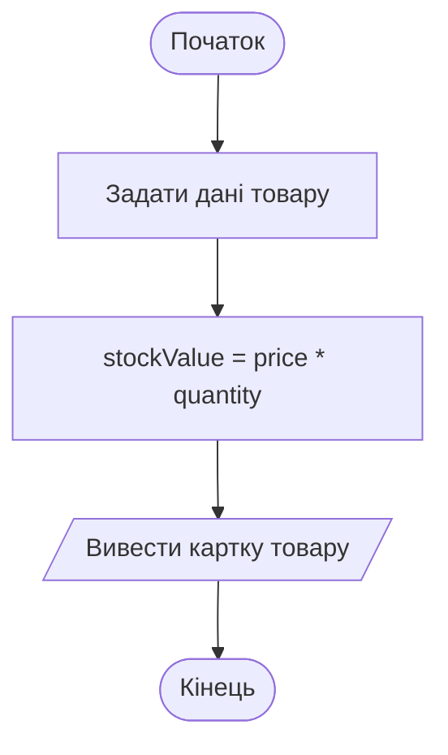

# 4. Виведення, змінні та типи даних

![block-badge] ![lang-badge]

## Зміст
1. [Виведення в консоль](#виведення-в-консоль)
2. [Українські літери в консолі](#українські-літери-в-консолі)
3. [Змінні](#змінні)
4. [Правила іменування змінних](#правила-іменування-змінних)
5. [Типи даних](#типи-даних)
6. [Константи](#константи)
7. [Конкатенація та інтерполяція рядків](#конкатенація-та-інтерполяція-рядків)
8. [Повний приклад](#повний-приклад)
9. [Підсумок](#підсумок)
10. [Запитання для самоперевірки](#запитання-для-самоперевірки)
11. [Довідкові матеріали](#довідкові-матеріали)

---

## Виведення в консоль

У цьому уроці ми повернемося до інтернет-магазину з уроку про блок-схеми і навчимося виводити в консоль **картку товару**: назву, ціну, кількість на складі. Для цього знадобляться дві команди виведення.

```C#
Console.Write("Інтернет-магазин ");
Console.Write("TechShop");
Console.WriteLine();
Console.WriteLine("Каталог товарів");
Console.WriteLine("Кошик");
```

Результат роботи:

```text
Інтернет-магазин TechShop
Каталог товарів
Кошик
```

| Команда | Що робить | Де опиниться наступний текст |
| :---- | :---- | :---- |
| **`Console.WriteLine(...)`** | виводить текст і **переводить курсор на новий рядок** | на наступному рядку |
| **`Console.Write(...)`** | виводить текст і **залишає курсор у тому самому рядку** | одразу після виведеного тексту |
| **`Console.WriteLine()`** | без тексту в дужках — просто переходить на новий рядок | на наступному рядку |

Перші два виклики `Write` надрукували текст в одному рядку, а `WriteLine()` з порожніми дужками завершив цей рядок. Зверніть увагу на пробіл у кінці `"Інтернет-магазин "`: без нього слова злиплися б у `Інтернет-магазинTechShop`. Якщо замість українських літер ви бачите знаки питання — читайте наступний розділ.

> [!TIP]
> **Порада:** `Console.Write` особливо знадобиться в наступному уроці — для підказок перед введенням даних: `Console.Write("Введіть ціну: ");` — і користувач друкує відповідь у тому самому рядку.

---

## Українські літери в консолі

Запустіть програму з українським текстом:

```C#
Console.WriteLine("Привіт, світе!");
```

На одних комп'ютерах ви побачите `Привіт, світе!`, а на інших — щось на кшталт:

```text
Прив?т, св?те!
```

або навіть суцільні знаки питання. Чому так?

> **Кодування символів** (character encoding) — таблиця, яка _ставить у відповідність кожному символу число_. Комп'ютер зберігає й передає не літери, а саме ці числа.

Консоль Windows за замовчуванням часто використовує **старе кодування**, у таблиці якого немає частини українських літер (наприклад, `і` чи `ґ`) або взагалі немає кирилиці. Символи, яких немає в таблиці, замінюються на `?`. Яке саме кодування буде в консолі — залежить від мови й регіональних налаштувань Windows, тому на різних комп'ютерах результат різний.

Розв'язок — перемкнути консоль на кодування **UTF-8**, у якому є символи всіх мов світу. Для цього першим рядком програми пишуть:

```C#
Console.OutputEncoding = System.Text.Encoding.UTF8;

Console.WriteLine("Привіт, світе!");
Console.WriteLine("Ґанок, їжак, єнот, ірис");
```

Результат роботи:

```text
Привіт, світе!
Ґанок, їжак, єнот, ірис
```

Той самий рядок можна записати коротше, якщо на початку файлу підключити простір імен `System.Text` командою `using`:

```C#
using System.Text;

Console.OutputEncoding = Encoding.UTF8;

Console.WriteLine("Привіт, світе!");
```

Результат роботи:

```text
Привіт, світе!
```

Обидва варіанти роблять одне й те саме — оберіть той, який вам зручніше запам'ятати. Що таке `using` і простори імен, детально розберемо в окремій темі.

> [!TIP]
> **Порада:** якщо програма виводить українські літери, починайте її з рядка `Console.OutputEncoding = System.Text.Encoding.UTF8;`. У прикладах уроків цей рядок **опущено**, щоб не захаращувати код, але у своїх програмах пишіть його завжди.

> [!NOTE]
> **Зверніть увагу:** навіть з UTF-8 деякі символи (емодзі, рідкісні знаки на кшталт `₴`) можуть не відображатися: це залежить ще й від шрифту консолі. Літери українського алфавіту, цифри та звичайні розділові знаки відображаються завжди.

---

## Змінні

Щоб вивести картку товару, програма має десь **зберігати** дані: назву, ціну, кількість. Звичайно, можна написати `Console.WriteLine("15");`, а що, як кількість зміниться? Доведеться шукати й переписувати це число по всій програмі.

> **Змінна** (variable) — іменована ділянка пам'яті, у якій програма _зберігає значення й може змінювати його під час роботи_. Змінна схожа на підписану коробку: на коробці — ім'я, всередині — значення.

```C#
string productName = "Навушники";
int quantity = 15;

Console.WriteLine(productName);
Console.WriteLine(quantity);
```

Результат роботи:

```text
Навушники
15
```

Зверніть увагу: `productName` і `quantity` у дужках написано **без лапок**. Без лапок — це ім'я змінної, і виводиться її значення. У лапках `"quantity"` — це просто текст, і виведеться саме слово `quantity`.

### Оголошення, ініціалізація та присвоювання

Розберемо рядок `int quantity = 15;`:

| Частина | Назва | Що означає |
| :---- | :---- | :---- |
| **`int`** | тип | які значення може зберігати змінна (тут — цілі числа) |
| **`quantity`** | ім'я | як ми звертатимемося до змінної |
| **`=`** | оператор присвоювання | «записати значення праворуч у змінну ліворуч» |
| **`15`** | значення | що саме записуємо |
| **`;`** | кінець команди | як і після будь-якої команди |

Ці дії можна розділити:

| Дія | Запис | Що відбувається |
| :---- | :---- | :---- |
| **Оголошення** (declaration) | `int quantity;` | створюється змінна певного типу, значення ще немає |
| **Присвоювання** (assignment) | `quantity = 15;` | у змінну записується значення (старе, якщо було, зникає) |
| **Ініціалізація** (initialization) | `int quantity = 15;` | оголошення й перше присвоювання одним рядком |

Тип пишуть **лише один раз** — під час оголошення. Далі до змінної звертаються просто на ім'я:

```C#
int quantity = 15;
Console.WriteLine(quantity);

quantity = 12; // продали 3 штуки
Console.WriteLine(quantity);
```

Результат роботи:

```text
15
12
```

> [!WARNING]
> **Часта плутанина:** знак `=` у програмуванні — це **не «дорівнює»**, а «записати». Запис `quantity = 12;` читається як «записати 12 у змінну `quantity`». Тому, наприклад, `12 = quantity;` — помилка: записати щось у число `12` неможливо.

### Типові помилки зі змінними

Використати змінну, якій ще не присвоєно значення:

```C#
int quantity;
Console.WriteLine(quantity);
```

Помилка компіляції:

```text
error CS0165: Use of unassigned local variable 'quantity'
```

Оголосити змінну з тим самим ім'ям удруге:

```C#
int quantity = 15;
int quantity = 12;
```

Помилка компіляції:

```text
error CS0128: A local variable or function named 'quantity' is already defined in this scope
```

Компілятор каже: «змінна з ім'ям `quantity` вже існує». Щоб змінити значення, тип повторно не пишуть: `quantity = 12;`.

> [!IMPORTANT]
> **Ключова ідея:** змінна має **тип**, **ім'я** та **значення**. Тип і ім'я задаються один раз під час оголошення, а значення можна змінювати скільки завгодно разів.

---

## Правила іменування змінних

Ім'я змінної (як і будь-яке ім'я в коді) називають **ідентифікатором** (identifier). Є правила, які перевіряє компілятор, і домовленості, яких дотримуються програмісти.

**Правила (інакше — помилка компіляції):**

- ім'я складається з літер, цифр і символу `_`
- ім'я **не може починатися з цифри**: `2price` — помилка, `price2` — можна
- пробіли заборонені: `product name` — помилка
- не можна використовувати **ключові слова** C#: `int`, `string`, `class`, `double`...
- великі й малі літери розрізняються: `quantity` і `Quantity` — **дві різні** змінні

**Домовленості (компілятор не перевіряє, але так пишуть усі):**

- імена змінних пишуть у стилі **camelCase**: перше слово з малої літери, кожне наступне — з великої: `productName`, `totalPrice`, `isAvailable`
- ім'я має пояснювати, **що** зберігає змінна: `price`, а не `p` чи `x`
- імена пишуть англійською

| Ім'я | Чи можна | Коментар |
| :---- | :---- | :---- |
| `productPrice` | так | ідеально: зрозуміло й у стилі camelCase |
| `productprice` | так | працює, але важко читати |
| `ProductPrice` | так | працює, але з великої літери в C# пишуть інші речі (наприклад, константи) |
| `p` | так | працює, але незрозуміло, що це |
| `product_price` | так | працює, але в C# так не прийнято |
| `2price` | ні | починається з цифри |
| `product price` | ні | містить пробіл |
| `double` | ні | ключове слово |

> [!NOTE]
> **Зверніть увагу:** технічно C# дозволяє імена з кирилиці (`ціна`, `кількість`), і програма скомпілюється. Але так не роблять: у професійному коді імена завжди англійською, щоб код міг прочитати будь-який програміст у світі.

---

## Типи даних

> **Тип даних** (data type) — характеристика змінної, яка визначає, _які значення вона може зберігати і що з ними можна робити_. Число можна помножити, текст — ні; тому для компілятора важливо знати, що лежить у «коробці».

C# — мова зі **статичною типізацією**: тип змінної задається під час оголошення раз і назавжди. У змінну типу `int` неможливо записати текст.

| Тип | Що зберігає | Приклади значень | Як записується значення |
| :---- | :---- | :---- | :---- |
| ![int-badge] | ціле число (від приблизно −2,1 млрд до 2,1 млрд) | `15`, `0`, `-7`, `2024` | цифри без крапки |
| ![double-badge] | дробове число | `1299.99`, `0.5`, `-3.14` | дробова частина **через крапку** |
| ![string-badge] | рядок — текст будь-якої довжини | `"Навушники"`, `"TechShop"`, `""` | у **подвійних** лапках |
| ![char-badge] | один символ | `'M'`, `'7'`, `'#'` | в **одинарних** лапках |
| ![bool-badge] | логічне значення: так чи ні | `true`, `false` | лише ці два слова |

Опишемо товар змінними різних типів:

```C#
string name = "Худі oversize";
char size = 'M';
int quantity = 15;
double price = 1250.5;
bool inStock = true;

Console.WriteLine(name);
Console.WriteLine(size);
Console.WriteLine(quantity);
Console.WriteLine(price);
Console.WriteLine(inStock);
```

Результат роботи:

```text
Худі oversize
M
15
1250,5
True
```

Зверніть увагу на два останні рядки. Логічне значення виводиться англійською з великої літери: `True` або `False`. А дробове число в коді записане з **крапкою** `1250.5`, а виведене з **комою** `1250,5`.

> [!NOTE]
> **Зверніть увагу:** у коді дробову частину **завжди** пишуть через крапку. А от під час виведення .NET враховує регіональні налаштування Windows: з українським форматом регіону виводиться кома (`1250,5`), з англійським (США) та в онлайн-компіляторах — крапка (`1250.5`). Детально про це — в наступному уроці, коли вводитимемо дробові числа з клавіатури.

> [!WARNING]
> **Часта помилка:** переплутати лапки. Один символ (`char`) — в одинарних лапках, рядок (`string`) — у подвійних:
> ```C#
> char size = "M";
> ```
> ```text
> error CS0029: Cannot implicitly convert type 'string' to 'char'
> ```
> `"M"` у подвійних лапках — це рядок, а змінна має тип `char`.
> ```C#
> string word = 'Привіт';
> ```
> ```text
> error CS1012: Too many characters in character literal
> ```
> В одинарних лапках може бути лише **один** символ.

Тому компілятор не дозволить записати в змінну значення іншого типу:

```C#
int quantity = "15";
```

Помилка компіляції:

```text
error CS0029: Cannot implicitly convert type 'string' to 'int'
```

`"15"` у лапках — це рядок із двох символів, а не число. Для компілятора це принципова різниця: число можна додавати й множити, а рядок — ні.

> [!NOTE]
> **Зверніть увагу:** в C# є й інші типи чисел: `long` — для дуже великих цілих, `float` — для дробових з меншою точністю, `decimal` — для грошових розрахунків, де важлива кожна копійка. Для навчальних задач нам цілком вистачить `int` і `double`.

---

## Константи

У магазині є значення, які під час роботи програми не повинні змінюватися: назва магазину, максимальна кількість товару в одному замовленні, вартість доставки.

> **Константа** (constant) — іменоване значення, яке _задається один раз і не може бути змінене_. Оголошується так само, як змінна, але зі словом `const` на початку.

```C#
const string ShopName = "TechShop";
const int MaxQuantity = 10;

Console.WriteLine(ShopName);
Console.WriteLine(MaxQuantity);
```

Результат роботи:

```text
TechShop
10
```

Імена констант у C# прийнято писати в стилі **PascalCase** — кожне слово з великої літери: `ShopName`, `MaxQuantity`.

Спроба змінити константу:

```C#
const int MaxQuantity = 10;
MaxQuantity = 20;
```

Помилка компіляції:

```text
error CS0131: The left-hand side of an assignment must be a variable, property or indexer
```

Компілятор каже: «ліворуч від `=` має бути змінна», а `MaxQuantity` — не змінна, а константа.

**Навіщо потрібні константи:**

- захист від випадкової зміни: компілятор не дозволить перезаписати значення
- зрозумілість: `MaxQuantity` пояснює себе краще, ніж просто число `10` посеред коду
- зручність змін: якщо ліміт зміниться, правимо одне місце, а не шукаємо число `10` по всій програмі

---

## Конкатенація та інтерполяція рядків

Виводити значення змінних по одному в окремих рядках незручно. Хочеться вивести `Товар: Навушники, на складі: 15 шт.` — тобто поєднати текст і значення змінних в одному рядку. Для цього є два способи.

### Конкатенація

> **Конкатенація** (concatenation) — _склеювання рядків_ за допомогою оператора `+`.

```C#
string name = "Навушники";
int quantity = 15;

Console.WriteLine("Товар: " + name);
Console.WriteLine("На складі: " + quantity + " шт.");
```

Результат роботи:

```text
Товар: Навушники
На складі: 15 шт.
```

Якщо до рядка «додати» число, число автоматично перетворюється на текст і приклеюється до рядка.

> [!WARNING]
> **Часта помилка:** забути, що `+` з рядком склеює, а не додає. Вираз обчислюється зліва направо:
> ```C#
> Console.WriteLine("Сума: " + 2 + 3);
> Console.WriteLine("Сума: " + (2 + 3));
> ```
> ```text
> Сума: 23
> Сума: 5
> ```
> У першому рядку спочатку `"Сума: " + 2` дає рядок `"Сума: 2"`, а потім до нього приклеюється `3`. У другому дужки змушують спочатку додати числа.

### Інтерполяція

> **Інтерполяція рядків** (string interpolation) — спосіб _вставити значення змінних прямо всередину рядка_. Перед лапками ставиться знак `$`, а змінні пишуться у фігурних дужках `{ }`.

```C#
string name = "Навушники";
int quantity = 15;
double price = 899.5;

Console.WriteLine($"Товар: {name}, на складі: {quantity} шт.");
Console.WriteLine($"Ціна: {price} грн");
Console.WriteLine($"Вартість усієї партії: {price * quantity} грн");
```

Результат роботи:

```text
Товар: Навушники, на складі: 15 шт.
Ціна: 899,5 грн
Вартість усієї партії: 13492,5 грн
```

У фігурних дужках можна писати не лише ім'я змінної, а й цілий **вираз**: `{price * quantity}` спочатку обчислить добуток, а потім вставить результат у рядок. Знак `*` означає множення; арифметику детально розберемо в наступному уроці.

> [!WARNING]
> **Часта помилка:** забути знак `$` перед лапками. Програма скомпілюється, але виведе фігурні дужки як звичайний текст:
> ```C#
> Console.WriteLine("Товар: {name}");
> ```
> ```text
> Товар: {name}
> ```

| Критерій | Конкатенація `+` | Інтерполяція `$"..."` |
| :---- | :---- | :---- |
| **Запис** | `"Товар: " + name + ", " + quantity + " шт."` | `$"Товар: {name}, {quantity} шт."` |
| **Читабельність** | важко: багато лапок і плюсів | легко: видно, як виглядатиме результат |
| **Ризик помилки** | високий: забуті пробіли, `"Сума: " + 2 + 3` | низький |
| **Коли використовувати** | склеїти два-три коротких шматки | майже завжди, коли в тексті є значення змінних |

**Головна різниця** — конкатенація склеює окремі шматки, а інтерполяція дає змогу написати рядок «як є» і просто позначити місця, куди підставити значення.

---

## Повний приклад

Зберемо все разом і виведемо картку товару інтернет-магазину. Окрім виведення даних, програма обчислює вартість усіх одиниць товару на складі. Спочатку — алгоритм:



На схемі: лінійний алгоритм — задати дані, обчислити вартість товарів на складі, вивести результат.

```C#
const string ShopName = "TechShop";

// Дані товару
string name = "Худі oversize";
char size = 'M';
double price = 1250.5;
int quantity = 15;
bool inStock = true;

// Обчислення
double stockValue = price * quantity;

// Виведення картки товару
Console.WriteLine($"=== {ShopName} ===");
Console.WriteLine($"Товар: {name}");
Console.WriteLine($"Розмір: {size}");
Console.WriteLine($"Ціна: {price} грн");
Console.WriteLine($"На складі: {quantity} шт.");
Console.WriteLine($"У наявності: {inStock}");
Console.WriteLine();
Console.WriteLine($"Вартість товару на складі: {price} * {quantity} = {stockValue} грн");
```

Результат роботи:

```text
=== TechShop ===
Товар: Худі oversize
Розмір: M
Ціна: 1250,5 грн
На складі: 15 шт.
У наявності: True

Вартість товару на складі: 1250,5 * 15 = 18757,5 грн
```

Зверніть увагу на останній рядок: інтерполяція дає змогу вивести не лише результат, а й **проміжний розрахунок** — які саме числа перемножувалися. Так користувачу легше перевірити, що програма порахувала правильно.

> [!IMPORTANT]
> **Ключова ідея:** дані зберігаємо в **змінних** відповідних типів, незмінні значення — у **константах**, а для виведення тексту зі значеннями використовуємо **інтерполяцію**. Щоб показати інший товар, достатньо змінити значення змінних — решта програми залишиться без змін.

---

## Підсумок

- `Console.WriteLine` виводить текст і переходить на новий рядок, `Console.Write` — залишається в тому самому рядку
- для коректного виведення українських літер першим рядком програми пишуть `Console.OutputEncoding = System.Text.Encoding.UTF8;`
- **змінна** має тип, ім'я (camelCase) і значення; тип задається один раз, значення можна змінювати
- основні типи: `int` (цілі), `double` (дробові, у коді через крапку), `string` (текст у `" "`), `char` (символ у `' '`), `bool` (`true`/`false`); **константа** (`const`) не змінюється
- значення змінних вставляють у текст **інтерполяцією** `$"... {змінна} ..."` або склеюють **конкатенацією** `+`

---

## Запитання для самоперевірки

1. Чим відрізняються `Console.Write` і `Console.WriteLine`? Що виведе `Console.WriteLine()` без тексту в дужках?
2. Чому в консолі замість українських літер можуть з'являтися знаки питання і як це виправити?
3. Що таке змінна? Чим оголошення відрізняється від ініціалізації?
4. Які з імен допустимі в C#: `totalPrice`, `2items`, `item count`, `isReady`, `string`? Чому?
5. Який тип даних ви оберете для: кількості студентів у групі, температури повітря, прізвища, оцінки за шкалою A–F, відповіді «чи склав іспит»?
6. Чим `'A'` відрізняється від `"A"`?
7. Чим константа відрізняється від змінної? Навіщо використовувати константи?
8. Що виведе `Console.WriteLine("Результат: " + 4 + 6);` і чому? Як виправити, щоб вивелося `Результат: 10`?
9. Що станеться, якщо в інтерполяції забути знак `$` перед лапками?

---

## Довідкові матеріали

- [Змінна (програмування)](https://uk.wikipedia.org/wiki/%D0%97%D0%BC%D1%96%D0%BD%D0%BD%D0%B0_(%D0%BF%D1%80%D0%BE%D0%B3%D1%80%D0%B0%D0%BC%D1%83%D0%B2%D0%B0%D0%BD%D0%BD%D1%8F)) — `uk.wikipedia.org`
- [Тип даних](https://uk.wikipedia.org/wiki/%D0%A2%D0%B8%D0%BF_%D0%B4%D0%B0%D0%BD%D0%B8%D1%85) — `uk.wikipedia.org`
- [Кодування символів](https://uk.wikipedia.org/wiki/%D0%9A%D0%BE%D0%B4%D1%83%D0%B2%D0%B0%D0%BD%D0%BD%D1%8F_%D1%81%D0%B8%D0%BC%D0%B2%D0%BE%D0%BB%D1%96%D0%B2) — `uk.wikipedia.org`
- [UTF-8](https://uk.wikipedia.org/wiki/UTF-8) — `uk.wikipedia.org`
- [Console.WriteLine Method](https://learn.microsoft.com/dotnet/api/system.console.writeline) — `learn.microsoft.com`
- [Console.OutputEncoding Property](https://learn.microsoft.com/dotnet/api/system.console.outputencoding) — `learn.microsoft.com`
- [Declaration statements - local variables and constants](https://learn.microsoft.com/dotnet/csharp/language-reference/statements/declarations) — `learn.microsoft.com`
- [Identifier names - rules and conventions](https://learn.microsoft.com/dotnet/csharp/fundamentals/coding-style/identifier-names) — `learn.microsoft.com`
- [Built-in types](https://learn.microsoft.com/dotnet/csharp/language-reference/builtin-types/built-in-types) — `learn.microsoft.com`
- [The const keyword](https://learn.microsoft.com/dotnet/csharp/language-reference/keywords/const) — `learn.microsoft.com`
- [$ - string interpolation - format string output](https://learn.microsoft.com/dotnet/csharp/language-reference/tokens/interpolated) — `learn.microsoft.com`

---
[block-badge]:https://img.shields.io/badge/%D0%9E%D1%81%D0%BD%D0%BE%D0%B2%D0%B8%20C%23-purple?style=flat
[lang-badge]:https://img.shields.io/badge/C%23-blue?style=flat&logo=dotnet
[int-badge]:https://img.shields.io/badge/int-blue?style=flat
[double-badge]:https://img.shields.io/badge/double-blue?style=flat
[string-badge]:https://img.shields.io/badge/string-green?style=flat
[char-badge]:https://img.shields.io/badge/char-green?style=flat
[bool-badge]:https://img.shields.io/badge/bool-orange?style=flat
