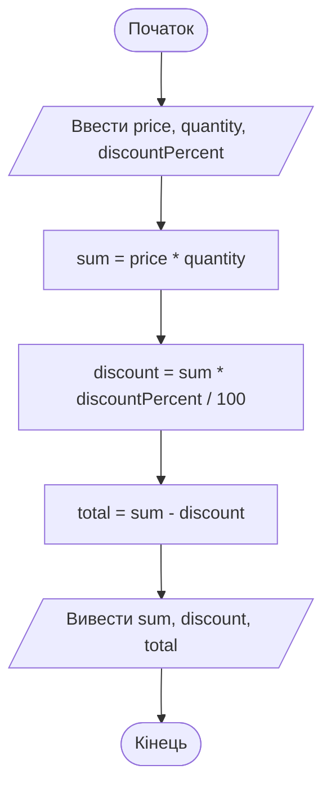

# 5. Введення даних та арифметика

![block-badge] ![lang-badge]

## Зміст
1. [Введення даних з клавіатури](#введення-даних-з-клавіатури)
2. [Перетворення рядка на число](#перетворення-рядка-на-число)
3. [Кома чи крапка в дробових числах](#кома-чи-крапка-в-дробових-числах)
4. [Арифметичні оператори](#арифметичні-оператори)
5. [Ділення цілих чисел та остача](#ділення-цілих-чисел-та-остача)
6. [Скорочені оператори присвоювання](#скорочені-оператори-присвоювання)
7. [Математичні функції Math](#математичні-функції-math)
8. [Форматування чисел](#форматування-чисел)
9. [Повний приклад](#повний-приклад)
10. [Підсумок](#підсумок)
11. [Запитання для самоперевірки](#запитання-для-самоперевірки)
12. [Довідкові матеріали](#довідкові-матеріали)

---

## Введення даних з клавіатури

У попередньому уроці всі дані товару були записані прямо в коді. Щоб показати інший товар, доводилося змінювати програму. Справжні програми працюють інакше: дані вводить **користувач**, а програма їх обробляє. Згадайте блок-схеми: майже кожен алгоритм починався з паралелограма `Ввести ...`.

> **`Console.ReadLine()`** — команда, яка _чекає, поки користувач надрукує текст і натисне Enter_, а потім повертає введений текст у програму.

```C#
Console.Write("Введіть ваше ім'я: ");
string name = Console.ReadLine();

Console.WriteLine($"Вітаємо в TechShop, {name}!");
```

<!--
> [!CAUTION]
> 📸 **TODO-IMG** `images/l5_i1.png`
> **Що зобразити:** консоль після запуску програми: рядок `Введіть ваше ім'я: ` з введеним ім'ям (наприклад, `Олена`) і під ним `Вітаємо в TechShop, Олена!`.
-->

Як це працює:

1. **`Console.Write`** виводить підказку й залишає курсор у тому самому рядку.
2. **`Console.ReadLine()`** зупиняє програму й чекає, поки користувач надрукує текст і натисне **Enter**.
3. Введений текст записується в змінну **`name`**.
4. **`Console.WriteLine`** виводить привітання з цим ім'ям.

> [!NOTE]
> **Зверніть увагу:** Visual Studio може підкреслити `Console.ReadLine()` зеленою хвилястою лінією з попередженням `CS8600` (_Converting null literal or possible null value to non-nullable type_). Це **попередження**, а не помилка: програма запуститься й працюватиме. Компілятор нагадує, що в рідкісних випадках `ReadLine` може повернути «порожнечу» (`null`) замість тексту. Для наших навчальних програм це попередження можна ігнорувати; коли ми почнемо перетворювати введення на числа через `Convert`, воно зникне.

### ReadLine завжди повертає рядок

Що б не ввів користувач — ім'я, число чи дату, — `Console.ReadLine()` повертає **рядок** (`string`). Якщо ввести `5`, програма отримає не число 5, а текст із символу `"5"`.

Подивимося, до чого це призводить. Нехай користувач ввів дві кількості товару: `5` і `3`. Програма отримає два рядки — те саме, що:

```C#
string a = "5";
string b = "3";
Console.WriteLine(a + b);
```

Результат роботи:

```text
53
```

Замість `8` вийшло `53`: оператор `+` **склеїв** два рядки, як ми бачили в попередньому уроці. А якщо спробувати записати результат `ReadLine` одразу в змінну типу `int`:

```C#
int quantity = Console.ReadLine();
```

Помилка компіляції:

```text
error CS0029: Cannot implicitly convert type 'string' to 'int'
```

> [!IMPORTANT]
> **Ключова ідея:** `Console.ReadLine()` **завжди** повертає рядок. Щоб виконувати обчислення з введеними числами, рядок потрібно **перетворити** на число.

---

## Перетворення рядка на число

Для перетворення рядка на число в .NET є готові команди:

| Команда | Результат | Приклад | Що отримаємо |
| :---- | :---- | :---- | :---- |
| **`Convert.ToInt32(рядок)`** | ![int-badge] | `Convert.ToInt32("15")` | `15` |
| **`Convert.ToDouble(рядок)`** | ![double-badge] | `Convert.ToDouble("899,5")` (про кому — див. нижче) | `899,5` |
| **`int.Parse(рядок)`** | ![int-badge] | `int.Parse("15")` | `15` |
| **`double.Parse(рядок)`** | ![double-badge] | `double.Parse("899,5")` | `899,5` |

Число `32` у назві `ToInt32` означає, що тип `int` займає в пам'яті 32 біти (біт — найменша одиниця інформації: 0 або 1). Запам'ятайте просто: `ToInt32` — для `int`, `ToDouble` — для `double`.

```C#
string text = "15";
int quantity = Convert.ToInt32(text);

Console.WriteLine(quantity + 5);
```

Результат роботи:

```text
20
```

Тепер `quantity` — справжнє число, і `+` додає, а не склеює.

На практиці змінну `text` не створюють: результат `ReadLine` одразу передають у `Convert`. Так у дужках опиняється одна команда всередині іншої — спочатку виконується внутрішня (`ReadLine`), потім зовнішня (`Convert.ToInt32`):

```C#
Console.Write("Введіть кількість товару: ");
int quantity = Convert.ToInt32(Console.ReadLine());

Console.WriteLine($"Після нової поставки (+10 шт.) буде: {quantity + 10} шт.");
```

<!--
> [!CAUTION]
> 📸 **TODO-IMG** `images/l5_i2.png`
> **Що зобразити:** консоль після запуску: `Введіть кількість товару: 15` і під ним `Після нової поставки (+10 шт.) буде: 25 шт.`.
-->

### Convert чи Parse

| Критерій | `Convert.ToInt32(...)` | `int.Parse(...)` |
| :---- | :---- | :---- |
| **Звичайне число** (`"15"`) | `15` | `15` |
| **`null`** (не порожній рядок!) | повертає `0` | аварійно завершує програму |
| **Попередження у Visual Studio** з `Console.ReadLine()` | немає | `CS8604` — можливий `null` |
| **Не число** (`"abc"`, `"3.5"`) | аварійно завершує програму | аварійно завершує програму |

`null` з'являється, лише якщо введення закрито (наприклад, натиснуто **Ctrl+Z** і **Enter**). А просто **Enter** — це порожній рядок `""`, а не `null`: на ньому і `Convert`, і `Parse` завершаться помилкою `FormatException`. Для звичайного введення обидва варіанти працюють однаково. У прикладах курсу використовуємо **`Convert`**: з ним Visual Studio не показує зайвих попереджень.

### Якщо введено не число

Що станеться, якщо на запит кількості користувач введе `abc`? Перетворити такий текст на число неможливо, і програма аварійно завершиться.

Помилка під час виконання:

```text
Unhandled exception. System.FormatException: The input string 'abc' was not in a correct format.
```

Після цього рядка консоль покаже ще кілька службових рядків (`at System.Number...`) — вони вказують, у якому місці коду сталася помилка. Головне — перший рядок: `FormatException` означає «рядок має неправильний формат для перетворення».

> [!WARNING]
> **Часта помилка:** ввести дробове число туди, де програма очікує ціле. `Convert.ToInt32("3.5")` або `Convert.ToInt32("3,5")` теж завершиться помилкою `FormatException`: ціле число не може мати дробової частини.

Як перевірити введення й не дати програмі «впасти», розберемо в окремій темі, коли вивчатимемо умови в C#. Поки що просто вводьте коректні дані.

---

## Кома чи крапка в дробових числах

У попередньому уроці ми бачили, що `double` у коді пишуть з **крапкою**, а виводиться він з **комою**. Під час введення з клавіатури ця різниця стає критичною.

`Convert.ToDouble` і `double.Parse` враховують **регіональні налаштування** системи, на якій запущено програму. Важлива не мова інтерфейсу Windows, а **формат регіону** (Settings → Time & language → Language & region → Regional format): буває англійська Windows з українським форматом і навпаки. В Україні дробову частину відокремлюють комою, тому з українським форматом регіону програма чекає саме кому:

```C#
Console.WriteLine(Convert.ToDouble("2,5"));
Console.WriteLine(Convert.ToDouble("2.5"));
```

Результат роботи з українським форматом регіону (перший рядок вивівся, на другому програма аварійно завершилася):

```text
2,5
Unhandled exception. System.FormatException: The input string '2.5' was not in a correct format.
```

На комп'ютері з англійським (США) форматом регіону та в онлайн-компіляторах усе навпаки:

| Де запущено програму | Роздільник | Введено `2,5` | Введено `2.5` |
| :---- | :---- | :---- | :---- |
| **Windows з українським форматом регіону** | кома | `2,5` | помилка `FormatException` |
| **Windows з англійським (США) форматом регіону** | крапка | `25` (!) | `2.5` |
| **Онлайн-компілятори** (OnlineGDB, Programiz) | крапка | `25` (!) | `2.5` |

> [!WARNING]
> **Часта помилка:** з англійським (США) форматом регіону кома вважається роздільником **тисяч** (як у записі `1,000,000`), тому `2,5` мовчки перетворюється на `25`. Програма не повідомляє про помилку, а просто рахує з неправильним числом — у 10 разів більшим. Це гірше за аварійне завершення: помилку можна й не помітити.

> [!TIP]
> **Порада:** щоб дізнатися, який роздільник очікує ваша програма, виведіть будь-яке дробове число: `Console.WriteLine(0.5);`. Якщо побачите `0,5` — вводьте дробові числа через кому; якщо `0.5` — через крапку.

---

## Арифметичні оператори

| Оператор | Дія | Приклад | Результат |
| :---- | :---- | :---- | :---- |
| **`+`** | додавання | `17 + 5` | `22` |
| **`-`** | віднімання | `17 - 5` | `12` |
| **`*`** | множення | `17 * 5` | `85` |
| **`/`** | ділення | `17 / 5` | `3` (!) |
| **`%`** | остача від ділення | `17 % 5` | `2` |

Результат `17 / 5 = 3` — не помилка в таблиці; про ділення цілих чисел поговоримо в наступному розділі.

### Пріоритет операторів

**Пріоритет операторів** (operator precedence) — порядок, у якому обчислюються оператори у виразі. Як і в математиці, множення й ділення виконуються **раніше** за додавання й віднімання, а оператори однакового пріоритету — **зліва направо**. Змінити порядок можна дужками.

```C#
Console.WriteLine(2 + 3 * 4);
Console.WriteLine((2 + 3) * 4);
Console.WriteLine(20 - 10 - 5);
Console.WriteLine(100 / 10 / 2);
```

Результат роботи:

```text
14
20
5
5
```

| Пріоритет | Оператори |
| :---- | :---- |
| **1** (найвищий) | дужки `( )` |
| **2** | `*`, `/`, `%` |
| **3** | `+`, `-` |

> [!TIP]
> **Порада:** якщо сумніваєтеся в порядку обчислень — ставте дужки. Зайві дужки не шкодять, а формулу `(a + b) / 2` читати легше, ніж згадувати правила пріоритету.

---

## Ділення цілих чисел та остача

### Цілочисельне ділення

> **Цілочисельне ділення** (integer division) — якщо **обидва** операнди оператора `/` цілі (`int`), результат теж буде цілим: _дробова частина просто відкидається_, без округлення.

```C#
int a = 7;
int b = 2;
Console.WriteLine(a / b);

double c = 7;
Console.WriteLine(c / b);
Console.WriteLine(7.0 / 2);
```

Результат роботи:

```text
3
3,5
3,5
```

Щоб отримати дробовий результат, достатньо, щоб **хоча б один** з операндів був дробовим: змінна типу `double` або число з крапкою (`7.0`, `2.0`).

> [!WARNING]
> **Часта помилка:** середнє арифметичне цілих чисел. Студент отримав оцінки 10, 11 і 11:
> ```C#
> Console.WriteLine((10 + 11 + 11) / 3);
> Console.WriteLine((10 + 11 + 11) / 3.0);
> ```
> ```text
> 10
> 10,666666666666666
> ```
> У першому рядку обидва операнди цілі (`32 / 3`), і дробова частина загубилася. Ділення на `3.0` дає правильний результат.

### Остача від ділення

> **Остача від ділення** (remainder) — оператор `%` повертає _те, що залишилося після цілочисельного ділення_. `17 % 5 = 2`, бо 17 = 5 × 3 + **2**.

Разом `/` і `%` розв'язують цілу групу практичних задач. Наприклад, на складі 23 навушники, а в коробку для відправлення вміщується 5 штук:

```C#
int items = 23;
int boxSize = 5;

int fullBoxes = items / boxSize;
int left = items % boxSize;

Console.WriteLine($"Повних коробок: {fullBoxes}, залишилось товарів: {left}");
```

Результат роботи:

```text
Повних коробок: 4, залишилось товарів: 3
```

**Де ще знадобиться остача:**

- перевести хвилини в години й хвилини: `135 / 60 = 2` год, `135 % 60 = 15` хв
- отримати останню цифру числа: `2024 % 10 = 4`
- перевірити, чи число парне: остача від ділення на 2 дорівнює `0`
- перевірити, чи ділиться одне число на інше без остачі

---

## Скорочені оператори присвоювання

Часто нове значення змінної обчислюється з її старого значення: `quantity = quantity + 5;`. Для таких випадків є коротші записи — **скорочені оператори присвоювання** (compound assignment):

| Скорочений запис | Те саме, що | Приклад (було `quantity = 10`) |
| :---- | :---- | :---- |
| **`quantity += 5;`** | `quantity = quantity + 5;` | стало `15` |
| **`quantity -= 3;`** | `quantity = quantity - 3;` | стало `7` |
| **`quantity *= 2;`** | `quantity = quantity * 2;` | стало `20` |
| **`quantity /= 4;`** | `quantity = quantity / 4;` | стало `2` |
| **`quantity++;`** | `quantity = quantity + 1;` | стало `11` |
| **`quantity--;`** | `quantity = quantity - 1;` | стало `9` |

```C#
int quantity = 10;

quantity += 5;  // надійшло 5 штук: 15
quantity -= 3;  // продали 3: 12
quantity *= 2;  // подвоїли запас: 24
quantity /= 4;  // розділили на 4 магазини: 6
quantity++;     // повернули 1: 7
quantity--;     // продали 1: 6

Console.WriteLine(quantity);
```

Результат роботи:

```text
6
```

Оператори `++` (інкремент, increment) та `--` (декремент, decrement) особливо часто трапляються в циклах, де потрібно рахувати повторення.

> [!NOTE]
> **Зверніть увагу:** поки що пишіть `++` і `--` лише окремою командою: `quantity++;`. Їх можна використовувати й усередині виразів, але тоді результат залежить від того, з якого боку стоїть оператор (`x++` чи `++x`), і код стає заплутаним.

---

## Математичні функції Math

Для складніших обчислень у .NET є готовий набір математичних функцій і констант — **`Math`**.

| Запис | Що робить | Приклад | Результат |
| :---- | :---- | :---- | :---- |
| **`Math.PI`** | константа — число π (пі) | `Math.PI` | `3,141592653589793` |
| **`Math.Pow(x, y)`** | піднесення `x` до степеня `y` | `Math.Pow(2, 10)` | `1024` |
| **`Math.Sqrt(x)`** | квадратний корінь з `x` | `Math.Sqrt(2)` | `1,4142135623730951` |

`Math.Pow` і `Math.Sqrt` повертають результат типу ![double-badge], навіть якщо передати їм цілі числа.

**Приклад:** що вигідніше — одна піца діаметром 30 см чи дві по 20 см? Порівняємо площу. Площа кола — π × r², де r — радіус (половина діаметра):

```C#
double oneBig = Math.PI * Math.Pow(15, 2);
double twoSmall = 2 * Math.PI * Math.Pow(10, 2);

Console.WriteLine($"Одна піца 30 см: {oneBig} кв. см");
Console.WriteLine($"Дві піци 20 см: {twoSmall} кв. см");
```

Результат роботи:

```text
Одна піца 30 см: 706,8583470577034 кв. см
Дві піци 20 см: 628,3185307179587 кв. см
```

Одна велика піца більша за дві маленькі! А ось приклад з коренем: діагональ монітора з шириною 60 см і висотою 34 см за теоремою Піфагора:

```C#
double width = 60;
double height = 34;
double diagonal = Math.Sqrt(Math.Pow(width, 2) + Math.Pow(height, 2));

Console.WriteLine($"Діагональ: {diagonal} см");
```

Результат роботи:

```text
Діагональ: 68,96375859826666 см
```

> [!WARNING]
> **Часта помилка:** записати степінь через `^`, як у калькуляторі чи Excel:
> ```C#
> Console.WriteLine(2 ^ 3);
> ```
> ```text
> 1
> ```
> Програма скомпілюється, але виведе `1`, а не `8`: у C# символ `^` — це зовсім інша операція (побітова, її ми не вивчаємо). Для степеня використовуйте `Math.Pow(2, 3)` або множення `2 * 2 * 2`.

---

## Форматування чисел

У прикладах вище числа виводилися з 13–16 знаками після коми: `706,8583470577034`. Для користувача це незручно — досить двох знаків.

> **Форматування числа** (number formatting) — спосіб _задати, як саме число виглядатиме під час виведення_. В інтерполяції формат пишуть після двокрапки: `{змінна:F2}` — вивести з двома знаками після коми.

```C#
double area = Math.PI * Math.Pow(15, 2);

Console.WriteLine($"{area}");
Console.WriteLine($"{area:F2}");
Console.WriteLine($"{area:F0}");

double price = 1250.5;
Console.WriteLine($"Ціна: {price:F2} грн");
```

Результат роботи:

```text
706,8583470577034
706,86
707
Ціна: 1250,50 грн
```

| Формат | Що означає | `706,8583...` виглядатиме як |
| :---- | :---- | :---- |
| **`F0`** | без дробової частини (з округленням) | `707` |
| **`F1`** | один знак після коми | `706,9` |
| **`F2`** | два знаки після коми | `706,86` |
| **`F3`** | три знаки після коми | `706,858` |

Літера `F` — від _fixed-point_ (фіксована кількість знаків), а цифра після неї — кількість знаків після коми. Зверніть увагу на ціну: `F2` не лише округлює, а й **доповнює** нулями — `1250,50`. Для грошових сум це саме те, що потрібно.

> [!NOTE]
> **Зверніть увагу:** форматування змінює лише **вигляд** числа під час виведення. Значення в змінній залишається точним: `area` як і раніше дорівнює `706,8583470577034`, і подальші обчислення використовуватимуть саме його.

---

## Повний приклад

Реалізуємо лінійний алгоритм з уроку про блок-схеми — **калькулятор замовлення**, але з невеликою зміною: розмір знижки не залежить від суми, а його вводить користувач (наприклад, з промокоду). Користувач вводить ціну товару, кількість і знижку у відсотках; програма обчислює суму, розмір знижки й суму до сплати, показуючи проміжні розрахунки.

Спочатку — алгоритм:



На схемі: лінійний алгоритм — введення трьох значень, три послідовні обчислення та виведення результатів.

Тепер запишемо його мовою C#:

```C#
Console.WriteLine("=== Калькулятор замовлення TechShop ===");

// Введення даних
Console.Write("Ціна товару, грн: ");
double price = Convert.ToDouble(Console.ReadLine());

Console.Write("Кількість, шт.: ");
int quantity = Convert.ToInt32(Console.ReadLine());

Console.Write("Знижка, %: ");
double discountPercent = Convert.ToDouble(Console.ReadLine());

// Обчислення
double sum = price * quantity;
double discount = sum * discountPercent / 100;
double total = sum - discount;

// Виведення результату
Console.WriteLine();
Console.WriteLine($"Сума: {price} * {quantity} = {sum:F2} грн");
Console.WriteLine($"Знижка: {sum:F2} * {discountPercent} / 100 = {discount:F2} грн");
Console.WriteLine($"До сплати: {sum:F2} - {discount:F2} = {total:F2} грн");
```

<!--
> [!CAUTION]
> 📸 **TODO-IMG** `images/l5_i3.png`
> **Що зобразити:** консоль після запуску з введеними значеннями `899,5`, `3`, `10`. Очікуваний результат під порожнім рядком:
> `Сума: 899,5 * 3 = 2698,50 грн`
> `Знижка: 2698,50 * 10 / 100 = 269,85 грн`
> `До сплати: 2698,50 - 269,85 = 2428,65 грн`
-->

Порівняйте блок-схему й код: паралелограму `Ввести` відповідають три пари `Console.Write` + `Convert...(Console.ReadLine())` — по одній на кожне значення, кожному прямокутнику — рядок з обчисленням, а паралелограму `Вивести` — команди `Console.WriteLine`.

> [!IMPORTANT]
> **Ключова ідея:** типова програма складається з трьох частин — **введення** (`ReadLine` + перетворення на число), **обчислення** (арифметичні оператори й `Math`) та **виведення** (інтерполяція з форматуванням). Саме так ми й складали лінійні алгоритми на блок-схемах.

---

## Підсумок

- `Console.ReadLine()` **завжди** повертає рядок; щоб рахувати, його перетворюють на число через `Convert.ToInt32` / `Convert.ToDouble` (або `int.Parse` / `double.Parse`)
- дробові числа під час введення пишуть з тим роздільником, який очікує система: з українським форматом регіону — **кома**, з англійським (США) та в онлайн-компіляторах — **крапка**
- оператори `+ - * / %`; множення й ділення виконуються раніше за додавання й віднімання; ділення двох цілих чисел **відкидає** дробову частину, а `%` дає остачу
- скорочені записи `+=`, `-=`, `*=`, `/=`, `++`, `--`; готові функції `Math.PI`, `Math.Pow`, `Math.Sqrt`
- `{x:F2}` виводить число з двома знаками після коми, не змінюючи значення змінної

---

## Запитання для самоперевірки

1. Значення якого типу повертає `Console.ReadLine()`? Що виведе програма, якщо «додати» два введені числа без перетворення?
2. Чим відрізняються `Convert.ToInt32` та `int.Parse`? Що станеться, якщо перетворювати текст `abc`?
3. Користувач ввів `2,5`, а програма порахувала з числом `25`. Чому так могло статися?
4. Обчисліть без комп'ютера: `2 + 3 * 4`, `(2 + 3) * 4`, `17 / 5`, `17 % 5`, `17.0 / 5`.
5. Чому `(10 + 11 + 11) / 3` дає `10`, а не `10,67`? Як це виправити?
6. Як за допомогою `/` і `%` перевести 200 хвилин у години й хвилини?
7. Що виведе `Console.WriteLine(3 ^ 2);` і чому? Як правильно піднести 3 до квадрата?
8. Чим `{price:F2}` відрізняється від `{price}`? Чи змінюється значення змінної `price` після такого виведення?

---

## Довідкові матеріали

- [Console.ReadLine Method](https://learn.microsoft.com/dotnet/api/system.console.readline) — `learn.microsoft.com`
- [Convert.ToInt32 Method](https://learn.microsoft.com/dotnet/api/system.convert.toint32) — `learn.microsoft.com`
- [Parsing Numeric Strings in .NET](https://learn.microsoft.com/dotnet/standard/base-types/parsing-numeric) — `learn.microsoft.com`
- [Arithmetic operators](https://learn.microsoft.com/dotnet/csharp/language-reference/operators/arithmetic-operators) — `learn.microsoft.com`
- [Math Class](https://learn.microsoft.com/dotnet/api/system.math) — `learn.microsoft.com`
- [Standard numeric format strings](https://learn.microsoft.com/dotnet/standard/base-types/standard-numeric-format-strings) — `learn.microsoft.com`

---
[block-badge]:https://img.shields.io/badge/%D0%9E%D1%81%D0%BD%D0%BE%D0%B2%D0%B8%20C%23-purple?style=flat
[lang-badge]:https://img.shields.io/badge/C%23-blue?style=flat&logo=dotnet
[int-badge]:https://img.shields.io/badge/int-blue?style=flat
[double-badge]:https://img.shields.io/badge/double-blue?style=flat
