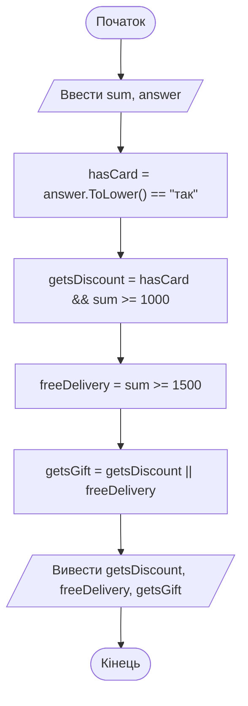

# 6. Логічний тип даних та логічні вирази

![block-badge] ![lang-badge]

## Зміст
1. [Логічний тип bool](#логічний-тип-bool)
2. [Оператори порівняння](#оператори-порівняння)
3. [Логічні оператори](#логічні-оператори)
4. [Пріоритет операторів у логічних виразах](#пріоритет-операторів-у-логічних-виразах)
5. [Перевірка діапазону](#перевірка-діапазону)
6. [Коротке обчислення](#коротке-обчислення)
7. [Типові помилки](#типові-помилки)
8. [Порівняння операторів І та АБО](#порівняння-операторів-і-та-або)
9. [Повний приклад](#повний-приклад)
10. [Де використовуються логічні вирази](#де-використовуються-логічні-вирази)
11. [Підсумок](#підсумок)
12. [Запитання для самоперевірки](#запитання-для-самоперевірки)
13. [Довідкові матеріали](#довідкові-матеріали)

---

## Логічний тип bool

Згадайте блок-схеми з уроку 2: у кожному ромбі було питання, на яке можна відповісти лише «так» або «ні» — `сума ≥ 2000?`, `самовивіз?`. Щоб програма могла приймати рішення, їй потрібен спосіб зберігати й обчислювати такі відповіді.

> **Логічний тип** (boolean type) — тип даних, який має _лише два значення_: `true` (істина, «так») і `false` (хибність, «ні»). У C# він називається `bool`.

Тип `bool` ви вже бачили в уроці 4 — у картці товару була змінна `inStock`:

```C#
bool inStock = true;
bool isDelivered = false;

Console.WriteLine(inStock);
Console.WriteLine(isDelivered);
```

Результат роботи:

```text
True
False
```

У коді значення пишуться з малої літери (`true`, `false`), а під час виведення .NET показує їх з великої (`True`, `False`).

> [!NOTE]
> **Зверніть увагу:** назва типу походить від імені англійського математика **Джорджа Буля** (George Boole), який у XIX столітті описав «алгебру логіки» — математику, у якій є лише два значення: істина та хибність. Саме на ній побудована робота будь-якого комп'ютера.

Змінні типу `bool` прийнято називати так, щоб ім'я читалося як питання з відповіддю «так/ні»: `isAdult` (чи повнолітній), `hasCard` (чи є картка), `inStock` (чи в наявності), `canBuy` (чи можна купити).

> [!WARNING]
> **Часта помилка:** вважати, що `1` — це «так», а `0` — «ні». У деяких мовах так і є, але не в C#:
> ```C#
> bool inStock = 1;
> ```
> ```text
> error CS0029: Cannot implicitly convert type 'int' to 'bool'
> ```
> У змінну `bool` можна записати лише `true`, `false` або **логічний вираз** — про них далі.

---

## Оператори порівняння

Найчастіше значення `bool` не записують вручну, а **обчислюють**, порівнюючи інші значення.

> **Логічний вираз** (boolean expression) — вираз, _результатом якого є `true` або `false`_. Найпростіший логічний вираз — порівняння двох значень: `quantity > 0`.

| Оператор | Значення | Приклад | Результат |
| :---- | :---- | :---- | :---- |
| **`==`** | дорівнює | `5 == 5` | `true` |
| **`!=`** | не дорівнює | `5 != 5` | `false` |
| **`>`** | більше | `7 > 3` | `true` |
| **`<`** | менше | `7 < 3` | `false` |
| **`>=`** | більше або дорівнює | `5 >= 5` | `true` |
| **`<=`** | менше або дорівнює | `4 <= 5` | `true` |

Перевіримо товар у магазині:

```C#
int quantity = 15;
double price = 1250.5;

bool hasItems = quantity > 0;
bool isExpensive = price >= 1000;
bool isOutOfStock = quantity == 0;

Console.WriteLine($"Є на складі: {hasItems}");
Console.WriteLine($"Дорогий товар: {isExpensive}");
Console.WriteLine($"Закінчився: {isOutOfStock}");
```

Результат роботи:

```text
Є на складі: True
Дорогий товар: True
Закінчився: False
```

Розберемо рядок `bool hasItems = quantity > 0;`. Спочатку обчислюється порівняння `quantity > 0`, тобто `15 > 0`, — результат `true`. Потім це значення записується в змінну `hasItems`.

> [!WARNING]
> **Часта плутанина:** `=` і `==` — різні оператори. Один знак `=` — це **присвоювання** («записати»), два знаки `==` — **порівняння** («чи дорівнює?»). Запис `quantity = 0` змінює кількість на нуль, а `quantity == 0` лише перевіряє, чи вона нульова.

### Порівняння рядків

Рядки теж можна порівнювати, але лише на рівність: `==` і `!=`.

```C#
string promoCode = "SALE10";

Console.WriteLine(promoCode == "SALE10");
Console.WriteLine(promoCode != "SALE10");
Console.WriteLine(promoCode == "sale10");
```

Результат роботи:

```text
True
False
False
```

Останній рядок — `False`: великі й малі літери для C# **різні**, тому `"SALE10"` і `"sale10"` — різні рядки. Як це обійти, розберемо в розділі «Типові помилки».

> [!NOTE]
> **Зверніть увагу:** оператори `<`, `>`, `<=`, `>=` для рядків не працюють: `"абрикос" < "банан"` дасть помилку компіляції `CS0019`. Як порівнювати рядки за абеткою, розберемо в окремій темі.

---

## Логічні оператори

Одного порівняння часто недостатньо. Магазин дає знижку **постійним клієнтам**, але лише **якщо** сума замовлення від 1000 грн. Тут дві умови одночасно: «є картка клієнта» **і** «сума ≥ 1000». Для поєднання умов є логічні оператори.

> **Логічні оператори** (logical operators) — оператори, які _поєднують кілька логічних значень в одне_: `&&` (І), `||` (АБО), `!` (НЕ).

### Оператор І (&&)

> **Логічне І** (logical AND, `&&`) — дає `true`, _лише якщо **обидві** умови істинні_.

```C#
bool hasCard = true;
double sum = 800;

bool getsDiscount = hasCard && sum >= 1000;

Console.WriteLine($"Знижка постійного клієнта: {getsDiscount}");
```

Результат роботи:

```text
Знижка постійного клієнта: False
```

Картка є, але сума менша за 1000 — одна з умов хибна, тому й результат хибний.

**Таблиця істинності** — таблиця, що показує результат оператора для всіх можливих комбінацій значень:

| `A` | `B` | `A && B` |
| :---- | :---- | :---- |
| **`false`** | `false` | `false` |
| **`false`** | `true` | `false` |
| **`true`** | `false` | `false` |
| **`true`** | `true` | `true` |

### Оператор АБО (||)

> **Логічне АБО** (logical OR, `||`) — дає `true`, _якщо **хоча б одна** з умов істинна_.

Доставка безкоштовна, якщо клієнт обрав самовивіз **або** сума замовлення від 1500 грн:

```C#
bool isPickup = false;
double sum = 1800;

bool freeDelivery = isPickup || sum >= 1500;

Console.WriteLine($"Безкоштовна доставка: {freeDelivery}");
```

Результат роботи:

```text
Безкоштовна доставка: True
```

Самовивозу немає, але сума достатня — однієї істинної умови вистачає.

| `A` | `B` | `A \|\| B` |
| :---- | :---- | :---- |
| **`false`** | `false` | `false` |
| **`false`** | `true` | `true` |
| **`true`** | `false` | `true` |
| **`true`** | `true` | `true` |

### Оператор НЕ (!)

> **Логічне НЕ** (logical NOT, `!`) — _змінює значення на протилежне_: `!true` дає `false`, `!false` дає `true`.

```C#
bool inStock = false;
bool needsRestock = !inStock;

Console.WriteLine($"Потрібно замовити у постачальника: {needsRestock}");
```

Результат роботи:

```text
Потрібно замовити у постачальника: True
```

| `A` | `!A` |
| :---- | :---- |
| **`false`** | `true` |
| **`true`** | `false` |

> [!TIP]
> **Порада:** символи `|` і `&` набирайте в **англійській розкладці** (в українській на цих клавішах інші символи). Вертикальна риска `|` — **Shift** + клавіша `\` (поруч з Enter), амперсанд `&` — **Shift+7**. Оператор АБО — це **дві** риски `||` без пробілу, а І — два амперсанди `&&`.

> [!IMPORTANT]
> **Ключова ідея:** `&&` вимагає, щоб істинними були **всі** умови, `||` — щоб **хоча б одна**, а `!` перевертає значення. Так у коді записуються звичайні слова «і», «або», «не».

---

## Пріоритет операторів у логічних виразах

У виразі можуть зустрітися арифметика, порівняння й логічні оператори одночасно: `price * quantity >= 1000 && !isPickup`. У якому порядку їх обчислювати?

| Пріоритет | Оператори | Що це |
| :---- | :---- | :---- |
| **1** (найвищий) | `( )` | дужки |
| **2** | `!` | логічне НЕ |
| **3** | `*` `/` `%` | множення, ділення, остача |
| **4** | `+` `-` | додавання, віднімання |
| **5** | `<` `>` `<=` `>=` | порівняння |
| **6** | `==` `!=` | рівність |
| **7** | `&&` | логічне І |
| **8** (найнижчий) | `\|\|` | логічне АБО |

Тому `price * quantity >= 1000` обчислюється природно: спочатку множення, потім порівняння. А от у поєднанні `&&` та `||` легко помилитися: **`&&` має вищий пріоритет за `||`**, тобто групується першим — як множення відносно додавання.

Магазин показує банер «Вигідна пропозиція», якщо товар **у наявності** і на нього діє **знижка або безкоштовна доставка**:

```C#
bool inStock = false;
bool hasDiscount = true;
bool freeDelivery = true;

bool showOffer1 = inStock && hasDiscount || freeDelivery;
bool showOffer2 = inStock && (hasDiscount || freeDelivery);

Console.WriteLine($"Без дужок: {showOffer1}");
Console.WriteLine($"З дужками: {showOffer2}");
```

Результат роботи:

```text
Без дужок: True
З дужками: False
```

Без дужок вираз читається як `(inStock && hasDiscount) || freeDelivery`: безкоштовної доставки вистачило, щоб показати банер товару, якого **немає в наявності**. З дужками спочатку обчислюється `hasDiscount || freeDelivery`, а потім — чи є товар у наявності. Саме цього ми й хотіли.

> [!TIP]
> **Порада:** якщо у виразі є і `&&`, і `||` — **завжди** ставте дужки, навіть коли пріоритет і так дає правильний результат. Дужки показують, що ви мали на увазі, і рятують від помилок.

---

## Перевірка діапазону

Дуже часто треба перевірити, чи потрапляє число в певний **діапазон**. Наприклад, у фільтрі магазину покупець задав ціну «від 500 до 2000 грн».

У математиці пишуть `500 ≤ price ≤ 2000`. У C# так не можна (чому — у розділі «Типові помилки»). Подвійну нерівність розбивають на **дві** умови, з'єднані `&&`: «ціна не менша за 500 **і** не більша за 2000».

```C#
double price = 1250.5;
double minPrice = 500;
double maxPrice = 2000;

bool inRange = price >= minPrice && price <= maxPrice;
bool outOfRange = price < minPrice || price > maxPrice;

Console.WriteLine($"Ціна у фільтрі: {inRange}");
Console.WriteLine($"Ціна поза фільтром: {outOfRange}");
```

Результат роботи:

```text
Ціна у фільтрі: True
Ціна поза фільтром: False
```

Зверніть увагу на дві перевірки:

- **всередині** діапазону: число не менше за нижню межу **І** не більше за верхню (`&&`)
- **поза** діапазоном: число менше за нижню межу **АБО** більше за верхню (`||`) — число не може бути одночасно і меншим за 500, і більшим за 2000

> [!NOTE]
> **Зверніть увагу:** вираз «поза діапазоном» можна записати й як заперечення «всередині»: `!(price >= minPrice && price <= maxPrice)`. Результат буде той самий. Але варіант з `||` без заперечення зазвичай легше прочитати.

---

## Коротке обчислення

> **Коротке обчислення** (short-circuit evaluation) — оператори `&&` і `||` _не обчислюють праву частину, якщо результат уже зрозумілий з лівої_.

- для `&&`: якщо ліва частина `false`, результат точно `false` — права не перевіряється
- для `||`: якщо ліва частина `true`, результат точно `true` — права не перевіряється

Це не лише економія часу — це спосіб **захиститися від помилок**. Нехай магазин перевіряє, чи середня ціна товару в кошику більша за 1000 грн. Середня ціна — це `total / quantity`, а ділити ціле число на нуль не можна. Якщо кошик порожній (`quantity = 0`), програма аварійно завершиться:

```C#
int quantity = 0;
int total = 0;

bool isExpensiveCart = total / quantity > 1000 && quantity > 0;
Console.WriteLine(isExpensiveCart);
```

Помилка під час виконання:

```text
Unhandled exception. System.DivideByZeroException: Attempted to divide by zero.
```

Поміняємо умови місцями — спочатку перевіримо, що кошик не порожній:

```C#
int quantity = 0;
int total = 0;

bool isExpensiveCart = quantity > 0 && total / quantity > 1000;
Console.WriteLine(isExpensiveCart);
```

Результат роботи:

```text
False
```

`quantity > 0` дало `false`, тому `&&` навіть не почав обчислювати `total / quantity` — і ділення на нуль не сталося.

> [!IMPORTANT]
> **Ключова ідея:** порядок умов в `&&` і `||` має значення. Спочатку пишіть умову-«охоронця», яка перевіряє, що далі можна безпечно рахувати, а потім — основну умову.

---

## Типові помилки

### Один знак = замість двох

```C#
int quantity = 5;
bool isZero = quantity = 0;
```

Помилка компіляції:

```text
error CS0029: Cannot implicitly convert type 'int' to 'bool'
```

`quantity = 0` — це присвоювання, його результат — число `0`, а не `true`/`false`. Для перевірки потрібно `quantity == 0`.

### Подвійна нерівність як у математиці

```C#
double price = 800;
bool inRange = 500 <= price <= 2000;
```

Помилка компіляції:

```text
error CS0019: Operator '<=' cannot be applied to operands of type 'bool' and 'int'
```

C# обчислює вираз зліва направо: `500 <= price` дає `true`, а далі виходить `true <= 2000` — порівнювати логічне значення з числом неможливо. Правильно: `price >= 500 && price <= 2000`.

### Порівняння дробових чисел через ==

```C#
Console.WriteLine(0.1 + 0.2 == 0.3);
Console.WriteLine(0.1 + 0.2);
```

Результат роботи:

```text
False
0,30000000000000004
```

Дробові числа зберігаються в пам'яті з невеликою похибкою, тому сума `0.1 + 0.2` не дорівнює **точно** `0.3`. Для `double` перевіряють не точну рівність, а те, що різниця між числами дуже мала:

```C#
Console.WriteLine(Math.Abs(0.1 + 0.2 - 0.3) < 0.000001);
```

Результат роботи:

```text
True
```

`Math.Abs` повертає модуль числа (значення без знака). Тож вираз читається так: «числа відрізняються менше ніж на одну мільйонну».

### Регістр літер у рядках

Користувач відповідає на питання «Є картка клієнта?» і вводить `Так` з великої літери. Програма порівнює з `"так"`:

```C#
string answer = "Так";

Console.WriteLine(answer == "так");
Console.WriteLine(answer.ToLower() == "так");
```

Результат роботи:

```text
False
True
```

`answer.ToLower()` перетворює всі літери рядка на малі (`"Так"` → `"так"`), тому друге порівняння спрацювало. Таку команду пишуть через крапку після імені змінної — як `Console.WriteLine`. Детально про інші команди для роботи з рядками — в окремій темі.

> [!WARNING]
> **Часта помилка:** порівнювати введений користувачем текст напряму. Користувач може ввести `так`, `Так` чи `ТАК`. Перш ніж порівнювати, приводьте введення до одного регістру через `.ToLower()`.

---

## Порівняння операторів І та АБО

| Критерій | `&&` (І) | `\|\|` (АБО) |
| :---- | :---- | :---- |
| **Результат `true`** | коли **всі** умови істинні | коли **хоча б одна** умова істинна |
| **Результат `false`** | коли **хоча б одна** умова хибна | коли **всі** умови хибні |
| **Коротке обчислення** | ліва `false` → права не перевіряється | ліва `true` → права не перевіряється |
| **Слова в умові задачі** | «і», «та», «водночас», «обидва» | «або», «чи», «хоча б одна» |
| **Приклад** | ціна від 500 **і** до 2000 | самовивіз **або** сума від 1500 |

> [!WARNING]
> **Часта плутанина:** переносити слово «і» з умови задачі в `&&` не замислюючись. «Знижка для студентів і пенсіонерів» означає, що кожен **окремий** покупець — **або** студент, **або** пенсіонер, тому в коді `isStudent || isPensioner`. Запитайте себе: чи мають обидві умови виконуватися для **одного** об'єкта одночасно? Якщо так — `&&`, якщо достатньо однієї — `||`.

**Головна різниця** — `&&` строгий: йому потрібні **всі** умови, а `||` поблажливий: йому достатньо **однієї**. Тому `&&` звужує вибір (фільтр «від 500 **і** до 2000» залишає менше товарів), а `||` розширює (умова «самовивіз **або** від 1500» робить доставку безкоштовною для більшої кількості замовлень).

---

## Повний приклад

Програма запитує суму замовлення й чи є в покупця картка постійного клієнта, а потім визначає, які бонуси він отримає. Спочатку — алгоритм:



На схемі: лінійний алгоритм — після введення даних програма обчислює три логічні значення, кожне з яких відповідає на своє питання «так/ні».

```C#
const double DiscountMinSum = 1000;
const double FreeDeliveryMinSum = 1500;

Console.Write("Сума замовлення, грн: ");
double sum = Convert.ToDouble(Console.ReadLine());

Console.Write("Є картка постійного клієнта? (так/ні): ");
string answer = Console.ReadLine();

bool hasCard = answer.ToLower() == "так";
bool getsDiscount = hasCard && sum >= DiscountMinSum;
bool freeDelivery = sum >= FreeDeliveryMinSum;
bool getsGift = getsDiscount || freeDelivery;

Console.WriteLine();
Console.WriteLine($"Знижка постійного клієнта: {getsDiscount}");
Console.WriteLine($"Безкоштовна доставка: {freeDelivery}");
Console.WriteLine($"Подарунок до замовлення: {getsGift}");
```

<!--
> [!CAUTION]
> 📸 **TODO-IMG** `images/l6_i1.png`
> **Що зобразити:** консоль після запуску з введеними значеннями `1200` і `Так`. Очікуваний результат під порожнім рядком:
> `Знижка постійного клієнта: True`
> `Безкоштовна доставка: False`
> `Подарунок до замовлення: True`
-->

Наприклад, для суми `1200` і відповіді `Так` програма виведе: знижка — `True` (картка є і сума ≥ 1000), безкоштовна доставка — `False` (сума < 1500), подарунок — `True` (є знижка, а для `||` цього достатньо).

> [!NOTE]
> **Зверніть увагу:** Visual Studio підкреслить `Console.ReadLine()` у рядку з `answer` попередженням `CS8600` — як і в попередньому уроці, його можна ігнорувати. А рядок `answer.ToLower()` може отримати попередження `CS8602` (_Dereference of a possibly null reference_) з тієї самої причини: компілятор нагадує, що `ReadLine` теоретично може повернути `null`.

Програма вже «приймає рішення», але поки лише виводить `True` чи `False`. Щоб залежно від умови виконувати **різні дії** — наприклад, вивести «Вітаємо, ваша знижка 10%!» або порахувати іншу суму, — потрібен оператор розгалуження `if`. Це тема наступного уроку.

---

## Де використовуються логічні вирази

Логічні вирази — це «мозок» будь-якої програми: усюди, де програма щось перевіряє, працює `bool`.

| Де | Логічний вираз | Оператори |
| :---- | :---- | :---- |
| **Фільтр інтернет-магазину** | ціна від мінімальної **і** до максимальної **і** товар у наявності | `>=`, `<=`, `&&` |
| **Вхід у систему** | логін збігається **і** пароль збігається | `==`, `&&` |
| **Каса в кінотеатрі** | глядачеві є 16 **або** фільм без вікових обмежень | `>=`, `\|\|` |
| **Гра** | персонаж живий (здоров'я > 0) **і** **не** на паузі | `>`, `&&`, `!` |
| **Розумний будинок** | увімкнути світло, якщо темно **і** хтось удома | `<`, `&&` |
| **Банківська картка** | оплата проходить, якщо картка **не** заблокована **і** вистачає коштів | `!`, `>=`, `&&` |

---

## Підсумок

- тип `bool` має лише два значення — `true` і `false`; найчастіше їх отримують як результат **логічного виразу**
- оператори порівняння `==`, `!=`, `<`, `>`, `<=`, `>=`; для рівності — **два** знаки `==`, бо один `=` — це присвоювання
- логічні оператори: `&&` (І — усі умови), `||` (АБО — хоча б одна), `!` (НЕ — протилежне значення); `&&` має вищий пріоритет за `||`, тому їх поєднання варто брати в дужки
- діапазон перевіряють двома умовами: `x >= min && x <= max`; запис `min <= x <= max` у C# не працює
- `&&` і `||` обчислюються **коротко**: права частина не перевіряється, якщо результат уже зрозумілий з лівої

---

## Запитання для самоперевірки

1. Які значення може мати змінна типу `bool`? Як вони виглядають у коді і під час виведення?
2. Чим відрізняються `=` і `==`?
3. Обчисліть без комп'ютера: `7 >= 7`, `3 != 3`, `true && false`, `true || false`, `!(5 > 2)`.
4. Знижка діє для студентів **і** пенсіонерів. Чому в коді цю умову треба записати через `||`, а не через `&&`?
5. Чому `500 <= price <= 2000` не компілюється? Як правильно перевірити, що ціна в цьому діапазоні?
6. Яке значення матиме `true || false && false` і чому?
7. Що таке коротке обчислення? Як воно допомагає уникнути ділення на нуль?
8. Чому `0.1 + 0.2 == 0.3` дає `False`?
9. Користувач ввів `ТАК`. Що дасть порівняння `answer == "так"` і як його виправити?

---

## Довідкові матеріали

- [Логічний тип даних](https://uk.wikipedia.org/wiki/%D0%9B%D0%BE%D0%B3%D1%96%D1%87%D0%BD%D0%B8%D0%B9_%D1%82%D0%B8%D0%BF) — `uk.wikipedia.org`
- [Алгебра логіки](https://uk.wikipedia.org/wiki/%D0%90%D0%BB%D0%B3%D0%B5%D0%B1%D1%80%D0%B0_%D0%BB%D0%BE%D0%B3%D1%96%D0%BA%D0%B8) — `uk.wikipedia.org`
- [Таблиця істинності](https://uk.wikipedia.org/wiki/%D0%A2%D0%B0%D0%B1%D0%BB%D0%B8%D1%86%D1%8F_%D1%96%D1%81%D1%82%D0%B8%D0%BD%D0%BD%D0%BE%D1%81%D1%82%D1%96) — `uk.wikipedia.org`
- [bool type](https://learn.microsoft.com/dotnet/csharp/language-reference/builtin-types/bool) — `learn.microsoft.com`
- [Comparison operators - order items using the greater than and less than operators](https://learn.microsoft.com/dotnet/csharp/language-reference/operators/comparison-operators) — `learn.microsoft.com`
- [Equality operators - test if two objects are equal or not equal](https://learn.microsoft.com/dotnet/csharp/language-reference/operators/equality-operators) — `learn.microsoft.com`
- [Boolean logical operators - the boolean and, or, not, and xor operators](https://learn.microsoft.com/dotnet/csharp/language-reference/operators/boolean-logical-operators) — `learn.microsoft.com`

---
[block-badge]:https://img.shields.io/badge/%D0%9E%D1%81%D0%BD%D0%BE%D0%B2%D0%B8%20C%23-purple?style=flat
[lang-badge]:https://img.shields.io/badge/C%23-blue?style=flat&logo=dotnet
