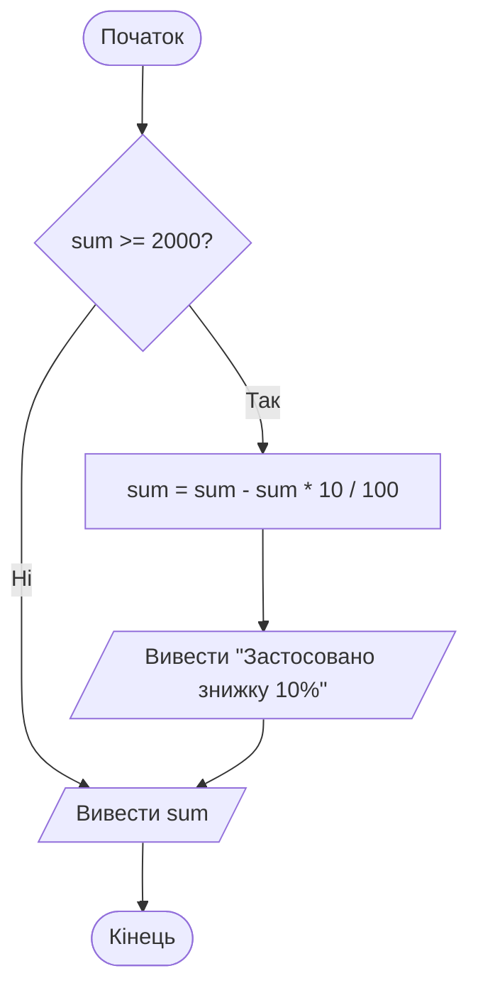
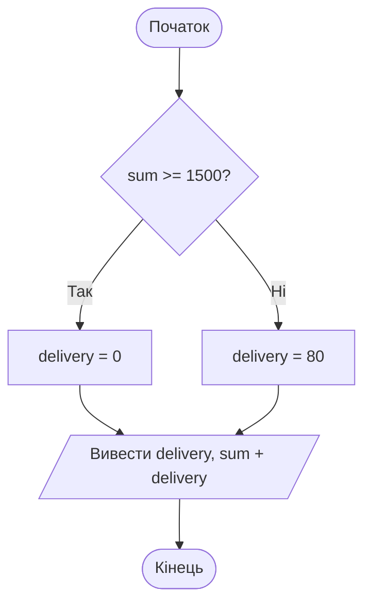
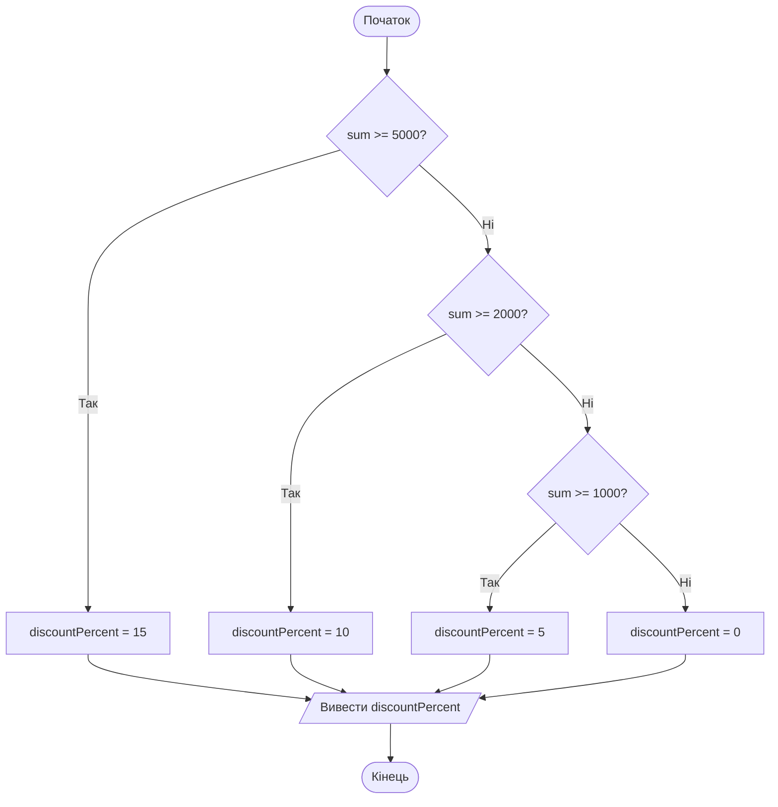
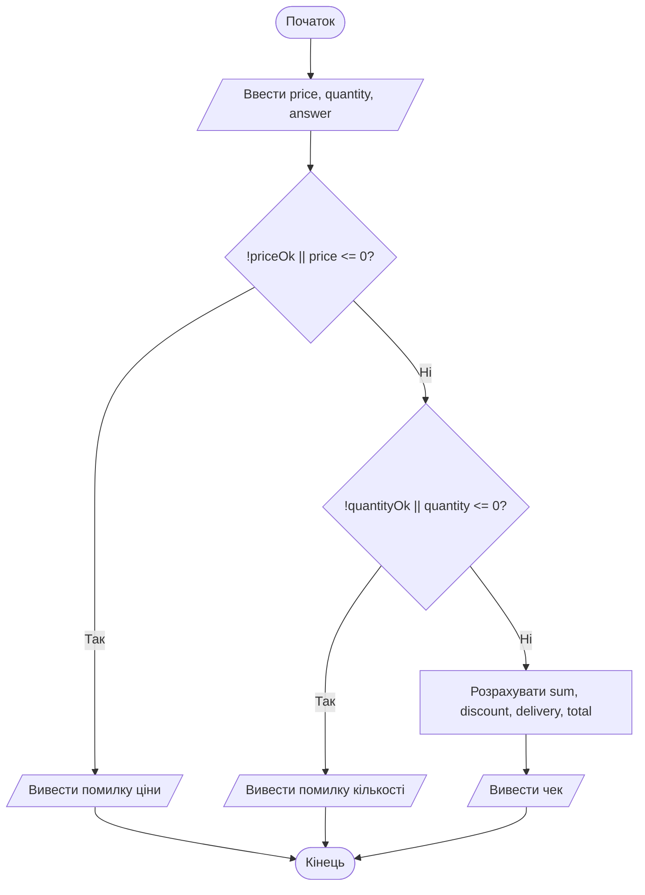

# 7. Оператор розгалуження if

![block-badge] ![lang-badge]

## Зміст
1. [Навіщо розгалуження в коді](#навіщо-розгалуження-в-коді)
2. [Оператор if](#оператор-if)
3. [Оператор if else](#оператор-if-else)
4. [Ланцюжок else if](#ланцюжок-else-if)
5. [Вкладені if](#вкладені-if)
6. [Порівняння конструкцій розгалуження](#порівняння-конструкцій-розгалуження)
7. [Блоки та видимість змінних](#блоки-та-видимість-змінних)
8. [Типові помилки](#типові-помилки)
9. [Перевірка введення через TryParse](#перевірка-введення-через-tryparse)
10. [Повний приклад](#повний-приклад)
11. [Де застосовується розгалуження](#де-застосовується-розгалуження)
12. [Підсумок](#підсумок)
13. [Запитання для самоперевірки](#запитання-для-самоперевірки)
14. [Довідкові матеріали](#довідкові-матеріали)

---

## Навіщо розгалуження в коді

Досі всі наші програми були **лінійними**: команди виконувалися одна за одною, згори донизу, кожна рівно один раз. У попередньому уроці програма вже вміла **перевіряти** умови, але могла лише вивести `True` чи `False`. А магазину потрібно інше: якщо сума від 2000 грн — **порахувати** знижку, якщо ні — не рахувати.

В уроці 2 ми малювали такі алгоритми блок-схемами з ромбами. Тепер навчимося записувати їх мовою C#.

> **Оператор розгалуження** (conditional statement) — конструкція мови, яка _виконує або пропускає частину коду залежно від умови_. У C# основний оператор розгалуження — `if` («якщо»).

| Блок-схема (урок 2) | C# |
| :---- | :---- |
| **Ромб з умовою** | `if (умова)` |
| **Гілка «Так»** | блок `{ ... }` одразу після `if` |
| **Гілка «Ні»** | блок `{ ... }` після `else` |
| **Неповне розгалуження** | `if` без `else` |
| **Повне розгалуження** | `if ... else` |
| **Вкладене розгалуження** | `if` всередині іншого `if` або ланцюжок `else if` |

---

## Оператор if

**Задача** (з уроку 2): якщо сума замовлення від 2000 грн, магазин дає знижку 10%.



На схемі: неповне розгалуження — дві дії виконуються лише за гілкою «Так», а гілка «Ні» одразу веде до виведення суми.

```C#
double sum = 2400;

if (sum >= 2000)
{
    sum = sum - sum * 10 / 100;
    Console.WriteLine("Застосовано знижку 10%");
}

Console.WriteLine($"До сплати: {sum} грн");
```

Результат роботи:

```text
Застосовано знижку 10%
До сплати: 2160 грн
```

Якщо змінити першу команду на `double sum = 1500;`, умова `1500 >= 2000` буде хибною і весь блок у фігурних дужках пропуститься.

Результат роботи:

```text
До сплати: 1500 грн
```

| Частина | Що означає |
| :---- | :---- |
| **`if`** | ключове слово «якщо» |
| **`(sum >= 2000)`** | умова в **круглих** дужках — будь-який логічний вираз з попереднього уроку |
| **`{ ... }`** | **блок** — команди, які виконуються, лише якщо умова дала `true` |
| **код після блоку** | виконується **завжди**, незалежно від умови |

Як це працює:

1. **Програма** обчислює умову в дужках → отримує `true` або `false`.
2. Якщо `true` → виконуються всі команди **блоку** `{ ... }`.
3. Якщо `false` → блок **пропускається** повністю.
4. Далі виконання продовжується з першої команди **після** блоку.

> [!NOTE]
> **Зверніть увагу:** після `if (...)` крапка з комою **не ставиться** — так само, як не ставиться вона після `{` чи `}`. Команди всередині блоку пишуть з відступом у 4 пробіли: так одразу видно, що вони «належать» до `if`. Visual Studio ставить відступи автоматично, а **Ctrl+K, Ctrl+D** вирівнює весь файл.

> [!TIP]
> **Порада:** якщо умова — це вже змінна типу `bool`, порівнювати її з `true` не потрібно. Замість `if (inStock == true)` пишіть просто `if (inStock)`, а замість `if (inStock == false)` — `if (!inStock)`.

---

## Оператор if else

**Задача** (з уроку 2): доставка безкоштовна, якщо сума від 1500 грн, інакше — 80 грн.



На схемі: повне розгалуження — кожна з двох гілок виконує свою дію, після чого гілки сходяться.

```C#
double sum = 1200;
double delivery;

if (sum >= 1500)
{
    delivery = 0;
}
else
{
    delivery = 80;
}

Console.WriteLine($"Доставка: {delivery} грн");
Console.WriteLine($"Разом: {sum + delivery} грн");
```

Результат роботи:

```text
Доставка: 80 грн
Разом: 1280 грн
```

> **`else`** («інакше») — блок, який _виконується, коли умова `if` хибна_. З двох блоків `if ... else` завжди виконується **рівно один**.

Зверніть увагу: змінна `delivery` оголошена **до** `if` без значення, а значення отримує в одній з гілок. Компілятор бачить, що гілок дві й кожна присвоює значення, тому дозволяє використати `delivery` після розгалуження.

> [!IMPORTANT]
> **Ключова ідея:** `if` без `else` — це неповне розгалуження («зроби щось або нічого»), `if ... else` — повне («зроби одне або інше»). У другому випадку одна з гілок виконається **обов'язково**.

---

## Ланцюжок else if

Іноді варіантів більше ніж два. Магазин робить знижку залежно від суми:

| Сума замовлення | Знижка |
| :---- | :---- |
| **від 5000 грн** | 15% |
| **від 2000, але менше 5000 грн** | 10% |
| **від 1000, але менше 2000 грн** | 5% |
| **менше 1000 грн** | немає |

> **Ланцюжок `else if`** — послідовність умов, _які перевіряються по черзі згори донизу; виконується блок **першої** істинної умови_, а решта пропускається. Якщо жодна умова не істинна — виконується фінальний `else` (якщо він є).



На схемі: кожна наступна умова перевіряється лише тоді, коли всі попередні виявилися хибними.

```C#
double sum = 2500;
int discountPercent;

if (sum >= 5000)
{
    discountPercent = 15;
}
else if (sum >= 2000)
{
    discountPercent = 10;
}
else if (sum >= 1000)
{
    discountPercent = 5;
}
else
{
    discountPercent = 0;
}

Console.WriteLine($"Знижка: {discountPercent}%");
```

Результат роботи:

```text
Знижка: 10%
```

Для суми 2500 програма перевірила `2500 >= 5000` — хибно, далі `2500 >= 2000` — істинно, виконала цей блок і **більше нічого не перевіряла**. Тому умова `sum >= 1000`, хоч вона теж істинна, вже не спрацювала.

Зверніть увагу: в умові `else if (sum >= 2000)` не потрібно писати `sum >= 2000 && sum < 5000`. Ми потрапляємо сюди, лише якщо попередня умова `sum >= 5000` хибна, тобто сума вже точно менша за 5000.

> [!WARNING]
> **Часта помилка:** неправильний порядок умов. Якщо почати з найменшої межі, перша ж умова «з'їсть» усі великі суми:
> ```C#
> double sum = 2500;
> int discountPercent;
>
> if (sum >= 1000)
> {
>     discountPercent = 5;
> }
> else if (sum >= 2000)
> {
>     discountPercent = 10;
> }
> else
> {
>     discountPercent = 0;
> }
>
> Console.WriteLine($"Знижка: {discountPercent}%");
> ```
> ```text
> Знижка: 5%
> ```
> `2500 >= 1000` — істинно, тому виконався перший блок, і до умови `sum >= 2000` справа не дійшла. Межі в ланцюжку з `>=` перевіряють **від більшої до меншої** (а з `<` — від меншої до більшої).

---

## Вкладені if

Усередині блоку `if` чи `else` можна писати будь-які команди — зокрема ще один `if`. Таке розгалуження називають **вкладеним** (nested).

**Задача:** постійного клієнта магазин вітає окремо і повідомляє про знижку (від 1000 грн) або про те, скільки до неї не вистачає. Іншим клієнтам пропонує оформити картку.

```C#
bool hasCard = true;
double sum = 800;

if (hasCard)
{
    Console.WriteLine("Вітаємо, постійний клієнте!");

    if (sum >= 1000)
    {
        Console.WriteLine("Ваша знижка: 10%");
    }
    else
    {
        Console.WriteLine($"До знижки не вистачає {1000 - sum} грн");
    }
}
else
{
    Console.WriteLine("Оформіть картку постійного клієнта, щоб отримувати знижки");
}
```

Результат роботи:

```text
Вітаємо, постійний клієнте!
До знижки не вистачає 200 грн
```

Внутрішній `if (sum >= 1000)` перевіряється лише для власників картки — для решти до нього справа просто не доходить.

### Вкладений if чи логічні оператори

Не кожне вкладене розгалуження потрібне. Згадайте задачу з самовивозом з уроку 2: доставка безкоштовна при самовивозі, а без нього — від 1500 грн. Її можна записати вкладеним `if`:

```C#
bool isPickup = false;
double sum = 1800;
double delivery;

if (isPickup)
{
    delivery = 0;
}
else
{
    if (sum >= 1500)
    {
        delivery = 0;
    }
    else
    {
        delivery = 80;
    }
}

Console.WriteLine($"Доставка: {delivery} грн");
```

Результат роботи:

```text
Доставка: 0 грн
```

Зверніть увагу: `else { if ... }` — це те саме, що ланцюжок `else if` з попереднього розділу, просто записаний з додатковими дужками.

Але дві гілки тут роблять **одне й те саме** (`delivery = 0`): гілка «Так» зовнішнього `if` і гілка «Так» внутрішнього. Отже, умови можна об'єднати оператором `||` з попереднього уроку:

```C#
bool isPickup = false;
double sum = 1800;
double delivery;

if (isPickup || sum >= 1500)
{
    delivery = 0;
}
else
{
    delivery = 80;
}

Console.WriteLine($"Доставка: {delivery} грн");
```

Результат роботи:

```text
Доставка: 0 грн
```

Результат той самий, а код — удвічі коротший і читається як умова задачі: «якщо самовивіз **або** сума від 1500 — доставка безкоштовна».

> [!TIP]
> **Порада:** якщо всередині зовнішнього `if` немає нічого, крім внутрішнього `if`, і ні в зовнішнього, ні у внутрішнього `if` немає `else`, — об'єднайте умови через `&&`: запис `if (a) { if (b) { ... } }` робить те саме, що `if (a && b) { ... }`. А якщо однакова дія стоїть у різних гілках (як у прикладі з доставкою) — умови об'єднують через `||`. Вкладений `if` потрібен, коли зовнішня гілка робить ще щось своє, як у прикладі з привітанням постійного клієнта.

---

## Порівняння конструкцій розгалуження

| Конструкція | Скільки блоків може виконатися | Коли використовувати | Приклад |
| :---- | :---- | :---- | :---- |
| **`if`** | 0 або 1 | дію треба виконати лише за певної умови | знижка від 2000 грн |
| **`if ... else`** | рівно 1 з 2 | є дві альтернативи | доставка 0 або 80 грн |
| **`if ... else if ... else`** | рівно 1 з кількох | кілька взаємовиключних варіантів | знижка 15 / 10 / 5 / 0% |
| **вкладений `if`** | залежить від обох умов | друга перевірка має сенс лише після першої | знижка — лише для власників картки |

**Головна різниця** — ланцюжок `else if` обирає **один** варіант із кількох рівноправних, а вкладений `if` будує **ієрархію**: спочатку загальне питання, і лише потім — уточнювальне.

---

## Блоки та видимість змінних

> **Блок** (block) — група команд у фігурних дужках `{ }`. _Змінна, оголошена всередині блоку, існує лише в ньому_: після закривної дужки `}` вона «зникає».

```C#
double sum = 2400;

if (sum >= 2000)
{
    double discount = sum * 10 / 100;
    Console.WriteLine($"Знижка: {discount} грн");
}

Console.WriteLine($"До сплати: {sum - discount} грн");
```

Помилка компіляції:

```text
error CS0103: The name 'discount' does not exist in the current context
```

Змінна `discount` оголошена всередині блоку `if`, тому в останньому рядку, поза блоком, її вже не існує. Частину коду, де змінну видно, називають **областю видимості** (scope).

Щоб змінна була доступна після `if`, її оголошують **до** розгалуження:

```C#
double sum = 2400;
double discount = 0;

if (sum >= 2000)
{
    discount = sum * 10 / 100;
    Console.WriteLine($"Знижка: {discount} грн");
}

Console.WriteLine($"До сплати: {sum - discount} грн");
```

Результат роботи:

```text
Знижка: 240 грн
До сплати: 2160 грн
```

Зверніть увагу: тут `discount` одразу отримує значення `0`. Якщо умова виявиться хибною, знижка залишиться нульовою, і останній рядок коректно виведе повну суму.

> [!IMPORTANT]
> **Ключова ідея:** змінні, потрібні **після** розгалуження, оголошуйте **перед** ним. Усередині блоку оголошуйте лише ті змінні, що потрібні тільки в ньому.

---

## Типові помилки

### Крапка з комою після if

```C#
double sum = 500;

if (sum >= 2000);
{
    Console.WriteLine("Застосовано знижку 10%");
}
```

Результат роботи:

```text
Застосовано знижку 10%
```

Сума 500, а знижку «застосовано»! Крапка з комою завершила `if` порожньою командою: «якщо сума від 2000 — нічого не робити». А блок `{ ... }` став звичайним блоком, що виконується завжди. Компілятор попереджає про це (`warning CS0642: Possible mistaken empty statement`), але програму запускає.

### if без фігурних дужок

Фігурні дужки можна не ставити, якщо в блоці **одна** команда. Але це пастка:

```C#
double sum = 500;

if (sum >= 2000)
    Console.WriteLine("Застосовано знижку 10%");
    sum = sum - sum * 10 / 100;

Console.WriteLine($"До сплати: {sum} грн");
```

Результат роботи:

```text
До сплати: 450 грн
```

Без дужок до `if` належить **лише перша** команда. Друга, попри відступ, виконується завжди — і знижку отримав клієнт із сумою 500 грн. Відступи для компілятора нічого не означають, межі блоку задають тільки фігурні дужки.

> [!WARNING]
> **Часта помилка:** дописати другу команду до `if` без дужок. Щоб не потрапити в цю пастку, **завжди** ставте фігурні дужки, навіть якщо команда одна.

### Значення присвоєно не в усіх гілках

```C#
double sum = 1200;
double delivery;

if (sum >= 1500)
{
    delivery = 0;
}

Console.WriteLine($"Доставка: {delivery} грн");
```

Помилка компіляції:

```text
error CS0165: Use of unassigned local variable 'delivery'
```

Якщо умова хибна, `delivery` так і не отримає значення, і компілятор не дозволяє її використати. Виправлення: додати гілку `else` з присвоюванням або задати початкове значення під час оголошення (`double delivery = 80;`).

---

## Перевірка введення через TryParse

В уроці 5 ми бачили, що `Convert.ToInt32("abc")` аварійно завершує програму помилкою `FormatException`. Тепер, коли є `if`, можна спочатку **перевірити**, чи введено число, і лише потім з ним працювати.

> **`int.TryParse`** (і `double.TryParse`) — команда, яка _намагається_ перетворити рядок на число. На відміну від `Convert`, вона **не** завершує програму помилкою, а повертає `bool`: `true` — вдалося, `false` — ні.

```C#
Console.Write("Кількість товару: ");

if (int.TryParse(Console.ReadLine(), out int quantity))
{
    Console.WriteLine($"Ви замовили {quantity} шт.");
}
else
{
    Console.WriteLine("Помилка: потрібно ввести ціле число");
}
```

<!--
> [!CAUTION]
> 📸 **TODO-IMG** `images/l7_i1.png`
> **Що зобразити:** два запуски програми в одній картинці (або дві консолі поруч): з введенням `15` — `Ви замовили 15 шт.`; з введенням `abc` — `Помилка: потрібно ввести ціле число`.
-->

Якщо ввести `15`, програма виведе `Ви замовили 15 шт.`, а якщо `abc` — `Помилка: потрібно ввести ціле число`. Аварійного завершення більше немає.

`TryParse` має повернути **два** результати: чи вдалося перетворення і саме число. Повернути можна лише одне значення (`bool`), тому число передається через **`out`**:

| Частина | Що означає |
| :---- | :---- |
| **`int.TryParse(...)`** | спробувати перетворити рядок на `int`; результат — `true` або `false` |
| **`Console.ReadLine()`** | рядок, який перетворюємо |
| **`out int quantity`** | оголосити змінну `quantity` і записати в неї число, якщо перетворення вдалося (якщо ні — там буде `0`) |

Що таке `out` і як воно працює «всередині», розберемо в окремій темі. Поки достатньо запам'ятати шаблон: `TryParse(рядок, out тип ім'я)`.

| Критерій | `Convert.ToInt32(...)` | `int.TryParse(..., out int x)` |
| :---- | :---- | :---- |
| **Коректне число** | повертає число | повертає `true`, число — в `x` |
| **Некоректне введення** | аварійно завершує програму | повертає `false`, програма працює далі |
| **Що робити з результатом** | одразу використовувати | спочатку перевірити в `if` |

> [!NOTE]
> **Зверніть увагу:** `double.TryParse` так само, як `Convert.ToDouble`, враховує формат регіону: з українським форматом він очікує кому (`899,5`), а на крапці (`899.5`) поверне `false`. Різниця лише в тому, що програма не «впаде», а повідомить про помилку.

Після перевірки «чи це число» часто треба перевірити ще й «чи це допустиме число»: кількість товару не може бути нульовою чи від'ємною. Для цього `TryParse` поєднують з іншими умовами — як саме, побачимо в повному прикладі.

---

## Повний приклад

Повернемося до калькулятора замовлення з уроку 5 і додамо до нього все, що вивчили. Одну зміну зробимо свідомо: замість введеного відсотка знижки повернемося до правила з уроку 2 — 10% від 2000 грн.

- перевірку введення: ціна — додатне дробове число, кількість — ціле число від 1
- знижку 10% від 2000 грн
- доставку: безкоштовна в разі самовивозу або від 1500 грн (вже з урахуванням знижки), інакше 80 грн

Це той самий алгоритм, який ми трасували в уроці 2, але з самовивозом і перевіркою введення. Програма довга, тому на схемі розрахунок знижки й доставки згорнуто в один блок — це схема з розділу «Перевірка алгоритму на тестових даних» уроку 2, до якої додано перевірку самовивозу (через `||`).



На схемі: ланцюжок перевірок — розрахунок виконується, лише якщо обидва введені значення коректні. `priceOk` і `quantityOk` — результати `TryParse`, тобто відповіді на питання «чи вдалося перетворити введення на число».

```C#
const double DiscountMinSum = 2000;
const double FreeDeliveryMinSum = 1500;
const double DeliveryPrice = 80;

Console.WriteLine("=== Калькулятор замовлення TechShop ===");

// Введення даних
Console.Write("Ціна товару, грн: ");
bool priceOk = double.TryParse(Console.ReadLine(), out double price);

Console.Write("Кількість, шт.: ");
bool quantityOk = int.TryParse(Console.ReadLine(), out int quantity);

Console.Write("Самовивіз? (так/ні): ");
string answer = Console.ReadLine();

Console.WriteLine();

// Перевірка введення та розрахунок
if (!priceOk || price <= 0)
{
    Console.WriteLine("Помилка: ціна має бути додатним числом");
}
else if (!quantityOk || quantity <= 0)
{
    Console.WriteLine("Помилка: кількість має бути цілим числом від 1");
}
else
{
    bool isPickup = answer.ToLower() == "так";
    double sum = price * quantity;

    double discount = 0;
    if (sum >= DiscountMinSum)
    {
        discount = sum * 10 / 100;
    }

    double sumWithDiscount = sum - discount;

    double delivery;
    if (isPickup || sumWithDiscount >= FreeDeliveryMinSum)
    {
        delivery = 0;
    }
    else
    {
        delivery = DeliveryPrice;
    }

    double total = sumWithDiscount + delivery;

    Console.WriteLine($"Сума: {price} * {quantity} = {sum:F2} грн");
    Console.WriteLine($"Знижка: {discount:F2} грн");
    Console.WriteLine($"Доставка: {delivery:F2} грн");
    Console.WriteLine($"До сплати: {total:F2} грн");
}
```

<!--
> [!CAUTION]
> 📸 **TODO-IMG** `images/l7_i2.png`
> **Що зобразити:** консоль після запуску з введеними значеннями `1000`, `2`, `ні`. Очікуваний результат під порожнім рядком:
> `Сума: 1000 * 2 = 2000,00 грн`
> `Знижка: 200,00 грн`
> `Доставка: 0,00 грн`
> `До сплати: 1800,00 грн`
-->

Перевіримо програму тестами з уроку 2 — результати мають збігтися з тими, що ми отримали трасуванням блок-схеми:

| Тест | Введено (ціна, кількість, самовивіз) | Очікувано за трасуванням (урок 2) | Програма вивела «До сплати» |
| :---- | :---- | :---- | :---- |
| **1** | `450`, `2`, `ні` | 980 | `980,00 грн` |
| **2** | `750`, `2`, `ні` | 1500 | `1500,00 грн` |
| **3** | `1000`, `2`, `ні` | 1800 | `1800,00 грн` |
| **4** | `1200`, `3`, `ні` | 3240 | `3240,00 грн` |
| **5** | `450`, `2`, `так` | — (новий випадок: самовивіз) | `900,00 грн` |
| **6** | `abc`, `2`, `ні` | — (некоректна ціна) | `Помилка: ціна має бути додатним числом` |
| **7** | `450`, `0`, `ні` | — (некоректна кількість) | `Помилка: кількість має бути цілим числом від 1` |

> [!NOTE]
> **Зверніть увагу:** програма спочатку запитує всі три значення і лише потім перевіряє їх. Тому навіть у разі помилки в ціні користувачеві доведеться ввести кількість і відповідь про самовивіз. Як зупинити програму одразу після першої помилки або повторювати запит, доки не введуть коректне значення, розберемо в окремих темах. Попередження `CS8600` і `CS8602` для рядка з `answer` — ті самі, що й у попередньому уроці.

> [!IMPORTANT]
> **Ключова ідея:** блок-схема з уроку 2 перетворилася на програму майже «один до одного»: кожен ромб став `if`, кожна гілка — блоком `{ }`. Тести, складені для блок-схеми, підходять і для перевірки програми.

---

## Де застосовується розгалуження

Практично кожна програма, якою ви користуєтеся, складається з тисяч `if`:

| Де | Яке розгалуження | Конструкція |
| :---- | :---- | :---- |
| **Вхід у застосунок** | якщо пароль правильний — відкрити акаунт, інакше — «Неправильний пароль» | `if ... else` |
| **Банкомат** | якщо коштів достатньо — видати гроші, інакше — повідомлення | `if ... else` |
| **Оцінювання тестів** | 90–100 — «відмінно», 75–89 — «добре», 60–74 — «задовільно», інакше — «незадовільно» | ланцюжок `else if` |
| **Гра** | якщо здоров'я персонажа ≤ 0 — показати «Game Over» | `if` |
| **Таксі** | якщо нічний час — нічний тариф; якщо ще й погана погода — додаткова надбавка | вкладений `if` |
| **Форма реєстрації** | якщо поле порожнє чи e-mail без `@` — підсвітити поле червоним | `if` з `\|\|` |

---

## Підсумок

- `if (умова) { ... }` виконує блок лише тоді, коли умова дорівнює `true`; `else { ... }` — коли `false`
- ланцюжок `else if` перевіряє умови згори донизу й виконує блок **першої** істинної; порядок умов має значення
- вкладений `if` потрібен, коли друга перевірка має сенс лише після першої; інакше умови краще об'єднати через `&&` / `||`
- змінна, оголошена всередині блоку `{ }`, не існує поза ним; змінні, потрібні після `if`, оголошують перед ним; фігурні дужки ставимо завжди, а крапку з комою після `if (...)` — ніколи
- `int.TryParse` / `double.TryParse` перевіряють, чи рядок є числом, не завершуючи програму помилкою

---

## Запитання для самоперевірки

1. Чим `if` без `else` відрізняється від `if ... else`? Скільки блоків може виконатися в кожному випадку?
2. Яка конструкція C# відповідає ромбу на блок-схемі? А гілкам «Так» і «Ні»?
3. Як працює ланцюжок `else if`? Що станеться, якщо істинними виявляться дві умови?
4. Чому в ланцюжку `if (sum >= 1000) ... else if (sum >= 2000) ...` друга умова ніколи не спрацює?
5. Коли вкладений `if` можна замінити однією умовою з `&&` чи `||`?
6. Що виведе приклад з розділу «Типові помилки» для суми 500, якщо після `if (sum >= 2000)` стоїть крапка з комою? Чому?
7. Чому змінна, оголошена всередині блоку `if`, недоступна після нього? Як це виправити?
8. Чим `int.TryParse` відрізняється від `Convert.ToInt32`? Що означає `out int quantity`?
9. Напишіть умову для оцінювання за шкалою 1–12: 10–12 — «високий рівень», 7–9 — «достатній», 4–6 — «середній», 1–3 — «початковий». У якому порядку краще перевіряти умови?

---

## Довідкові матеріали

- [Умовний перехід](https://uk.wikipedia.org/wiki/%D0%9E%D0%BF%D0%B5%D1%80%D0%B0%D1%82%D0%BE%D1%80_%D1%80%D0%BE%D0%B7%D0%B3%D0%B0%D0%BB%D1%83%D0%B6%D0%B5%D0%BD%D0%BD%D1%8F) — `uk.wikipedia.org`
- [if and switch statements - select a code path to execute](https://learn.microsoft.com/dotnet/csharp/language-reference/statements/selection-statements) — `learn.microsoft.com`
- [Declaration statements - local variables and constants](https://learn.microsoft.com/dotnet/csharp/language-reference/statements/declarations) — `learn.microsoft.com`
- [Int32.TryParse Method](https://learn.microsoft.com/dotnet/api/system.int32.tryparse) — `learn.microsoft.com`
- [Double.TryParse Method](https://learn.microsoft.com/dotnet/api/system.double.tryparse) — `learn.microsoft.com`

---
[block-badge]:https://img.shields.io/badge/%D0%9E%D1%81%D0%BD%D0%BE%D0%B2%D0%B8%20C%23-purple?style=flat
[lang-badge]:https://img.shields.io/badge/C%23-blue?style=flat&logo=dotnet
